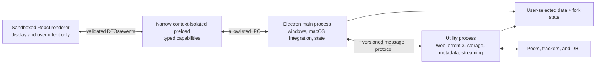

# Maintained WebTorrent Desktop fork: modernization plan

Status: **approved; migration in progress**

Research snapshot: **2026-07-24**

Working branch: `feat/webtorrent-updated`

Migration approved by the repository owner: **2026-07-24**

## 1. Purpose and approval boundary

This document makes the product, architecture, dependency, security, platform,
testing, release, and maintenance decisions for turning this repository into a
maintained WebTorrent Desktop fork. It is intentionally more specific than a
roadmap and less granular than a file-by-file implementation checklist.

The repository owner explicitly approved this plan and instructed the migration
to begin on 2026-07-24. Future amendments remain explicit decisions recorded in
this document.

Approval authorizes the local migration, dependency installation, packaging,
and tests on this branch. Release, merge, upstream submission, and use of
publishing credentials remain separately controlled actions.

### Decision vocabulary

- **Decided**: the migration will follow this choice unless this plan is
  explicitly amended.
- **Acceptance gate**: the primary choice is decided, but must prove a named
  property early. The fallback is also decided in advance.
- **Owner input**: a product identity, credential, account, budget, or policy
  value that cannot be inferred from the code.
- **Deferred**: intentionally excluded from the first maintained release, not
  forgotten.

## 2. Executive judgment

The maintained fork is feasible. The repository contains roughly 9,400 lines
of application JavaScript, so its size is not the central problem. Its age has
instead concentrated risk at nearly every trust boundary:

- the public release is from 2020 even though the source branch later received
  hundreds of mostly automated dependency commits;
- macOS packaging is explicitly Intel-only;
- non-x64 update architecture detection falls through to `ia32`;
- Electron 27 is end-of-life;
- WebTorrent 1.9 predates the current ESM, WebRTC, storage, and streaming APIs;
- renderers have unrestricted Node and Electron access;
- `@electron/remote` and an arbitrary IPC relay erase process boundaries;
- the development start command disables Chromium’s sandbox globally;
- Spectron is deprecated;
- release automation uses Node 16 and retired artifact actions;
- signing, notarization, update hosting, and platform metadata are obsolete or
  tied to the original project;
- the dependency tree contains abandoned casting packages, a Git-branch
  dependency, deprecated packaging modules, and pre-modern React UI code; and
- torrent metadata is untrusted input that can influence filesystem paths.

This is therefore a replatform, not a version bump or an Apple Silicon flag
change.

The central migration risks are native WebRTC packaging, two-phase metadata and
safe storage, tracker/DHT egress mediation, resume behavior, legacy-data
import, and packaged-app testing on Apple Silicon.

## 3. What actually breaks Apple Silicon

Electron has shipped Apple Silicon binaries since Electron 11. The current
failure is application packaging and architecture handling, not a fundamental
Electron limitation.

The concrete causes in this repository are:

1. The macOS packaging script requests `x64` only.
2. Architecture mapping treats every non-x64 machine as `ia32`.
3. The packaging scripts and local launch workflow predate current Apple
   Silicon Electron behavior.
4. Electron 27 and its embedded Chromium/Node stack are unsupported.
5. Current WebTorrent brings native WebRTC code that must be packaged, loaded,
   and tested for arm64.
6. Existing automation does not build or launch an Apple Silicon artifact.

The pinned upstream issue, unofficial ARM fork, and open upstream PR are useful
evidence but are not suitable migration bases:

- [Pinned issue #2522](https://github.com/webtorrent/webtorrent-desktop/issues/2522)
  points to an unsigned ARM build and correctly demonstrates that native Apple
  Silicon packaging is possible.
- [The referenced `v0.25.0-arm64` fork release](https://github.com/gingergeek8192/webtorrent-desktop/releases/tag/v0.25.0-arm64)
  updates Electron and packaging enough to produce an ARM artifact, but retains
  WebTorrent 1.9, privileged renderers, Spectron, old CI, inherited branding,
  and broad package-manager overrides. Its release is labeled 0.25 while assets
  still identify as 0.24.
- [Upstream PR #2509](https://github.com/webtorrent/webtorrent-desktop/pull/2509)
  changes the macOS target from x64 to arm64, but does not modernize the engine,
  security model, dependencies, tests, or build system.

Decision: use those changes as research, not as a branch to merge or a fork to
base this work on.

## 4. Scope of the first maintained personal build

### 4.1 Required functional scope

The first maintained build preserves the useful desktop-client surface on the
owner’s current M-series Mac:

- add torrents from magnet links, info hashes, local `.torrent` files, and
  bounded remote `.torrent` URLs;
- create and seed a torrent from a selected file or directory;
- start, pause, resume, remove, and delete torrents;
- select files and prioritize playback;
- stream supported audio and video with seek/range support;
- handle external subtitle files and embedded audio-track selection where the
  runtime supports it;
- inspect audio metadata and embedded artwork within strict size limits;
- open media in a user-selected external player;
- watch a user-selected folder for `.torrent` files;
- preserve macOS menu, dock, power-save, notification, and startup behaviors;
- register magnet and `.torrent` capabilities without silently taking over OS
  defaults;
- import legacy WebTorrent Desktop settings and torrent history safely; and
- produce a native arm64 application that launches and works on the owner’s
  machine.

### 4.2 Intentional first-release removals

These are explicit risk reductions:

- **AirPlay, Chromecast, and DLNA casting are removed.** Their three direct
  libraries and discovery/protocol trees are abandoned or stale. Casting may
  return only as a separately designed, hardware-tested feature.
- **uTP is disabled.** WebTorrent’s optional `utp-native` 2.5.3 module is stale
  and has an unresolved connection-pool hang report. TCP and WebRTC remain.
- **Local Service Discovery and automatic port mapping are disabled.** Start
  both clients with `lsd: false`, `natUpnp: false`, and `natPmp: false`.
  Reintroduction is a separately disclosed, network-tested feature; it is not
  an implicit default inherited from WebTorrent.
- **Automatic video-frame poster extraction is deferred.** Embedded artwork,
  bounded image extraction, saved legacy posters, and generic media art remain.
  A future sandboxed media worker can restore video thumbnails.
- **Inherited telemetry, remote crash upload, and announcements are removed.**
  No request is sent to the original `webtorrent.io` endpoints.
- **All non-Apple-Silicon targets are out of scope.** No Intel macOS, Windows,
  Linux, universal binary, or cross-platform compatibility work is required.
- **Bundled sample torrents are not inserted on fresh installs.** The app opens
  to an empty state; deterministic synthetic torrents replace public swarms in
  tests. Imported legacy samples remain ordinary user entries.
- **Pure BitTorrent v2 and hybrid torrents are not supported or advertised.**
  The engine is explicitly BitTorrent v1 until upstream WebTorrent supports
  BEP 52.

### 4.3 Deliberate non-goals

**Owner instruction, 2026-07-25: the interface does not change.** The
migrated application presents the same interface as the original WebTorrent
Desktop — same layout, same navigation, same screens, same visual identity —
and adds no new user-facing feature. The migration replaces the technology
underneath the interface, not the interface. Reproducing an original screen is
required work; introducing a new screen, control, or affordance is not
permitted without an explicit amendment. The only visible differences are the
intentional removals already listed in section 4.2, which appear as absent
controls rather than as replacements.

- no visual redesign during migration;
- no new user-facing feature, screen, control, or affordance;
- no search, catalog, RSS, remote-control, account, sync, or library feature;
- no browser extension;
- no App Store submission or public distribution pipeline;
- no code-signing certificate, notarization, update hosting, or automatic
  updater;
- no mobile build;
- no replacement of WebTorrent with libtorrent or another engine;
- no attempt to add BEPs that current WebTorrent does not support;
- no anonymous or privacy-network claims; and
- no automatic import that mutates or deletes the original app’s data.

Accessibility corrections, secure dialogs, and platform-native behavior are
allowed even when they cause small visual differences.

## 5. Local identity and version line

The personal fork still needs a different local identity so it cannot overwrite
the original app’s settings.

Decisions:

- Use `WebTorrent Updated` as the display name and
  `local.webtorrent-updated.desktop` as its separate bundle identity.
- Use a new application-data directory. Never point the fork at the original
  writable `WebTorrent` data directory.
- Preserve the MIT license and original copyright/author history.
- Start at `1.0.0-dev` and use ordinary SemVer for local builds. There are no
  beta/stable channels or platform-specific updater versions.
- Maintain an integer persisted-data `schemaVersion` independently from the
  application version.
- Use the fork-specific `WU` peer client code so it does not impersonate
  upstream.

## 6. Runtime and toolchain baseline

Migration approval froze the checked 2026-07-24 snapshot below. These are exact
pins, not floating ranges.

| Area | 2026-07-24 snapshot | Decision |
| --- | --- | --- |
| Electron | 43.2.0 | Qualify the exact arm64 runtime on the owner’s Mac. |
| Development Node | 24.18.0 LTS | Pin Node 24 LTS in developer metadata and local tooling. Reassess Node 26 only after it becomes LTS and the toolchain supports it. |
| Package manager | npm 11.16.0 bundled with Node 24.18 | Keep bundled npm 11.16.0 and lockfile v3. Use `npm ci --ignore-scripts`, then the owned exact-artifact acquisition in section 6.2; do not introduce Bun, pnpm, Yarn, Corepack, a separately installed npm, or newly released npm 12 during migration. |
| WebTorrent | 3.0.16 | Migrate to the exact qualified WebTorrent release. |
| Electron Forge | 7.11.2 | Use the stable exact Forge line for the local arm64 app, native unpacking, and fuses. |
| Build | Vite 8.1.5 | Bundle renderer and Electron entries with exact Vite. |
| Language | TypeScript 6.0.3 | Strict TypeScript for application source; defer TypeScript 7 until `typescript-eslint` supports it. |
| UI | React 19.2.8 | Use `createRoot` and modern JSX; do not add a UI framework. |
| Unit/component test | Vitest 4.1.10 | Replace Tape and use React Testing Library for components. |
| Desktop E2E | WebdriverIO 9.30/9.29 exact suite + scoped Electron service 10.1.0 | Replace Spectron. The core packages are pinned to their exact registry-published versions listed in section 14.6; Playwright’s Electron API remains experimental and is not selected. |
| Lint/format | ESLint 10.7.0 + Prettier 3.9.6 | Replace Standard/Babel ESLint. Add React Hooks rules and Knip dependency checks. |

### 6.1 Forge/Vite integration gate

Primary choice: run exact-pinned Vite 8 directly and feed its outputs to Forge
7 packaging through small, owned Forge lifecycle hooks. Do not use
`@electron-forge/plugin-vite`: the stable Forge 7.11 line is coupled to the
Vite 5 generation, while the Forge line that explicitly moved the plugin to
Vite 8 is still alpha.

Controls:

- all Forge packages are exact-pinned to one version and updated as a group;
- Vite and Forge minor upgrades are manually reviewed;
- development startup waits for main, preload, utility-process, and renderer
  outputs before launching Electron, and owns cleanup/HMR behavior explicitly;
- main, preload, utility-process, renderer, and packaged production outputs are
  exercised in the first toolchain milestone; and
- Vite externalizes Electron, Node built-ins, and every third-party import
  executed by main or engine, including `webtorrent` and its qualified
  compatibility subpaths, `parse-torrent`, `bencode`, `undici`, `ws`,
  `@thaunknown/simple-peer`, `bittorrent-protocol`, `create-torrent`,
  `music-metadata`, and `chokidar`.
  App-owned main/engine modules remain bundled, while Node-runtime packages
  retain their Node export conditions, ESM identity, and native dependency
  chains. Browser-safe renderer dependencies remain bundled.
- Main and engine typechecking use Node-conditioned ESM resolution rather than
  TypeScript's browser-oriented `Bundler` condition. Packaged contract tests
  exercise `music-metadata.parseFile`, `chokidar`, and every externalized
  engine compatibility subpath so a browser export cannot be selected
  silently.
- Package verification derives the complete direct-runtime inventory from the
  exact source manifest, checks every packaged name and version, and rejects
  missing, extra, or unexpected native artifacts.

If direct Vite integration finds a release-blocking defect, first move to the
latest supported patch of the same Vite major, then the newest still-supported
Vite major. Changing Forge major, adopting electron-builder, or adopting a
second bundler requires an explicit amendment to this plan.

### 6.2 Script-free artifact acquisition

`npm ci --ignore-scripts` intentionally leaves Electron's runtime and
`node-datachannel`'s addon absent. One owned, fail-closed acquisition command
runs after install and before development, test, or packaging:

1. invoke exact `electron@43.2.0`'s checked-in `install.js` directly with
   mirror/proxy artifact overrides rejected; require its official checksum,
   then independently require SHA-256
   `ad4a0ae3c37ee05aa06c7e2ed0627608389790f0505a2b0d20319efbe33ffe28`
   for `electron-v43.2.0-darwin-arm64.zip` and verify the extracted executable
   reports Electron 43.2.0 and Mach-O arm64;
2. fetch only
   `https://github.com/murat-dogan/node-datachannel/releases/download/v0.32.3/node-datachannel-v0.32.3-napi-v8-darwin-arm64.tar.gz`;
   require archive SHA-256
   `69fbffdacb9abda2a76809693443328b6aad71af25947e0733913340365f4da8`,
   reject links, absolute/traversal paths, and every member except
   `build/Release/node_datachannel.node`, then require binary SHA-256
   `1d4f814bede82a5412b19e8973e44eb484d504acc52f17796e90add75dc9ac80`,
   Mach-O arm64, and a successful Node-API load.

Do not execute `node-datachannel`'s lifecycle script, deprecated transitive
`prebuild-install@7.1.3`, a compiler, or Forge rebuild. The deprecated helper
is unavoidable in the exact upstream npm dependency graph but receives no
execution authority and is pruned with its otherwise unreachable install-only
tree from the packaged app. The repository owner tracks its removal to the
next requalified `node-datachannel` release. A clean acquisition must work from
an empty artifact cache and leave a recorded URL/hash/result; a cache hit is
accepted only after the same hashes and shape checks.

## 7. Target process architecture

The current hidden WebTorrent renderer exists for performance but combines DOM,
Node, filesystem, networking, and unrestricted Electron access. The replacement
separates those responsibilities.

### 7.1 Main process

The main process owns:

- application and window lifecycle;
- the custom application protocol;
- menus, dialogs, notifications, tray, dock, taskbar, power-save, and external
  player launching;
- file and protocol activation;
- startup registration and folder watching;
- persisted configuration and legacy import;
- validation and authorization of renderer requests;
- starting, supervising, and stopping the engine utility process; and
- redacted local diagnostics.

It does not own torrent protocol state or expose general Electron APIs to the
renderer.

### 7.2 UI renderer

Use one normal application renderer:

- call `app.enableSandbox()` before readiness so sandboxing is inherited by
  every renderer, including any accidentally added later;
- `nodeIntegration: false`;
- `contextIsolation: true`;
- `sandbox: true`;
- no `@electron/remote`, `ipcRenderer`, filesystem, process, child-process, or
  network imports;
- no `webview`;
- strict production CSP without `unsafe-eval`;
- navigation locked to the fork’s custom application origin;
- new-window requests denied;
- permission requests denied unless a future feature explicitly introduces one;
  and
- external links opened only through an HTTPS allowlist and main-process
  validation.

The About screen becomes a native About panel or a route in the same sandboxed
renderer. There are no privileged About or hidden WebTorrent browser windows.

### 7.3 Preload bridge

The preload exposes a small `window.desktop` capability API. It does not expose
raw `ipcRenderer`, Electron objects, event objects, arbitrary channel names, or
generic “send” methods.

Every command and event:

- has a named schema;
- is validated at runtime with Zod 4;
- has a TypeScript type inferred from that schema;
- carries a protocol version where it crosses the engine boundary;
- returns serializable plain data; and
- has bounded sizes and explicit error codes.

Main validates the sender URL and frame for every renderer-originated IPC call.
Subscriptions return an unsubscribe function and strip the Electron event
argument.

### 7.4 Engine utility process

Use `utilityProcess.fork()` for an ESM Node process. It owns:

- WebTorrent, `parse-torrent`, and `create-torrent`;
- separate public and private WebTorrent clients behind one app registry;
- TCP, WebRTC, DHT, tracker, and receive-side PEX traffic;
- torrent lifecycle and a map keyed by info hash;
- file selection and piece/resume state;
- storage-path validation and payload I/O;
- torrent-file and resume-sidecar writes;
- audio metadata and bounded artwork extraction; and
- an app-owned, per-file loopback media proxy.

The utility process is crash containment, not an OS security sandbox. It has
network and filesystem authority by design, so torrent input validation remains
a release-critical boundary.

Add/remove/destroy operations are serialized per info hash. Commands are
idempotent where practical, include generation identifiers, and never depend on
WebTorrent’s asynchronous `client.get()` as the authoritative app registry.
The registry records which client owns each torrent. Known private torrents use
a client created with `dht: false`, `lsd: false`, and `utPex: false`; public
torrents use the public client. WebTorrent's built-in DHT, `utPex`, and LSD are
disabled in both clients; bounded app-owned standalone DHT and receive-only PEX
boundaries provide the supported public-torrent discovery behavior.

Every WebTorrent client uses `dht: false`, `tracker: false`,
`webSeeds: false`, `utPex: false`, `lsd: false`, `utp: false`,
`natUpnp: false`, `natPmp: false`, and `secure: 1`. Public DHT discovery is
performed only by the app-owned boundary in section 9.7. A disposable staging
client never gains DHT authority; an explicitly consented metadata operation
borrows one generation-scoped discovery capability from the same boundary.

Create both long-lived clients once per engine and accept torrent additions
only after both report `listening`. Attach client error handling before
asynchronous work and torrent error handling before each add can emit. A
contained torrent error destroys and tombstones only that torrent. A destroyed
listener or connection pool, or any compatibility invariant failure, is
engine-fatal. A DHT compatibility failure is also engine-fatal; ordinary UDP
unavailability is a DHT-scoped warning and leaves tracker operation available.
Each long-lived client owns a distinct TCP listener even when trackers, DHT,
LSD, NAT traversal, and uTP are disabled. App-owned tracker announces use the
owning client's actual peer ID; HTTP also uses its listening port, while WSS
has no meaningful BitTorrent port field.

Reserve every info hash in the app registry across both clients before calling
WebTorrent's asynchronous add path. The reservation remains through rollback
or the completed destruction callback; WebTorrent's client-local duplicate
check and add callback are not lifecycle authority. `maxConns` is enforced per
torrent rather than per client or engine, so a separate shared admission budget
must bound connections and discovery queues across both clients.

The exact engine-wide peer-admission budget is 55 live peer-transport leases
(TCP plus WebRTC) and 256 total peer-record leases across public, private, and
staging clients. Each torrent may retain at most 128 peer records. At most two
metadata acquisitions run concurrently; staging is limited to eight live peer
transports and 32 records in aggregate, and four peer transports and 16 records
per acquisition. PEX-origin records are limited to 64 engine-wide and 50 per
torrent; all narrower limits are subsets of the peer budgets. Tracker HTTP
requests, tracker WSS control sockets, and DHT UDP/RPC work do not consume these
peer-transport leases; they have the separate exact caps below and in section
9.7. One round-robin scheduler shares released peer capacity across torrents
instead of allowing a busy torrent to drain its queue repeatedly.

At most 64 torrents are loaded in WebTorrent at once and their validated
manifests plus open preparations contain at most 250,000 aggregate file
entries. Additional durable torrents remain unloaded until the user starts one
or capacity becomes available. To make room, unload only the
least-recently-used clean paused torrent after its resume sidecar and destroy
callback complete; never evict a running/checking torrent, and return a visible
capacity error when none is eligible. Tracker metadata contains at most eight tiers,
four URLs per tier, and 32 unique URLs. The separate tracker-control budgets
are eight concurrent HTTP requests and eight live WSS sockets engine-wide,
with at most one WSS socket for an active tier.

Main supervises the process. One unexpected exit triggers a clean restart and
state reconstruction; repeated exits enter a visible stopped state rather than
an infinite crash loop. A crash never authorizes data deletion.

### 7.5 State ownership

Separate three kinds of state:

1. **Durable state in main**: preferences, window bounds, torrent manifests,
   selections, resume references, playback history, and schema version.
2. **Runtime torrent state in engine**: WebTorrent objects, peers, bitfields,
   streams, sockets, speeds, and progress.
3. **Ephemeral UI state in renderer**: current route, selection, modal, menus,
   controls, and presentation-only state.

Use React’s reducer/context and `useSyncExternalStore` primitives instead of
adding Redux, Zustand, or another global-store dependency during migration.
Progress DTOs are intentionally compact and rate-limited; no WebTorrent class,
stream, error, or private bitfield object crosses IPC.

## 8. Electron security baseline

### 8.1 Application content

- Register a secure, standard `app://` scheme before app readiness.
- Remove `--no-sandbox` from every development, test, and production launch;
  fix runner configuration instead of disabling the process sandbox.
- Package production code in ASAR and load only from the application scheme.
- Separate development CSP from a strict production CSP.
- Disable navigation and popups, including redirects.
- Deny session permission, certificate, and authentication requests unless a
  documented feature requires them.
- Validate all paths and URLs in main or engine, never only in renderer code.
- Use `shell.openExternal` only for validated `https:` URLs; reject credentials,
  control characters, file URLs, and unexpected schemes.
- Never evaluate torrent names, tracker responses, update notes, logs, or error
  text as HTML.

### 8.2 Production Electron fuses

Final artifacts set and independently inspect:

- `RunAsNode = false`;
- `EnableNodeOptionsEnvironmentVariable = false`;
- `EnableNodeCliInspectArguments = false`;
- `EnableEmbeddedAsarIntegrityValidation = true`;
- `OnlyLoadAppFromAsar = true`;
- `EnableCookieEncryption = true`;
- `GrantFileProtocolExtraPrivileges = false`; and
- the current safe default for the remaining Electron fuses, with any change
  documented in the release review.

The normal test build may keep inspection available where WebdriverIO requires
it. A separately packaged local production-fuse app must still pass launch,
protocol, and playback smoke tests on the owner’s Mac.

### 8.3 Threat model

Treat all of the following as untrusted:

- `.torrent` bytes and magnet parameters;
- torrent file names, paths, counts, lengths, piece geometry, trackers, and web
  seeds;
- peers, DHT, PEX, tracker, WebRTC signaling, and HTTP responses;
- downloaded media, subtitles, images, and tags;
- remote torrent URLs and redirects;
- dropped files and OS activation arguments;
- legacy config, cached `.torrent` files, posters, and resume data;
- renderer messages if the UI is compromised.

The security goal is containment and least authority, not anonymity. Torrent
peers can see IP addresses, protocol encryption is not a VPN, and this must be
clear in user-facing documentation.

## 9. WebTorrent 3 and protocol decisions

### 9.1 What the upgrade provides

Move from WebTorrent 1.9.7 to exact WebTorrent 3.0.16. WebTorrent 3 is
ESM-only and requires Node 22 or newer. It supplies current:

- WebRTC support in Node through `webrtc-polyfill`;
- W3C-like file and stream APIs;
- client-wide streaming server APIs, used only as research because the fork
  serves files through its stricter proxy;
- tracker, store, selection, and connection fixes;
- current protocol submodules;
- performance and port-exhaustion fixes; and
- resume-bitfield support.

The official BEP matrix does **not** show newly supported BEPs between the
current desktop engine and WebTorrent 3. The value is implementation
maintenance and correctness, not BitTorrent v2.

### 9.2 Advertised protocol scope

Supported:

- BitTorrent v1 info hashes;
- magnet metadata exchange;
- IPv4 DHT for public torrents, policy-mediated trackers, receive-side PEX,
  private torrents, file selection, IPv4 TCP peers, and policy-filtered IPv4
  WebRTC web peers; and
- BEP 53 selected-file parameters when no saved app selection exists.

Not supported or claimed:

- BEP 52 BitTorrent v2 or hybrid torrents;
- IPv6 DHT/tracker support;
- BEP 44 mutable torrents; and
- uTP, LSD, or BEP 19 HTTP(S) web seeds in the first maintained release.

Pure v2 and hybrid metadata receive a clear unsupported-format error before
storage is constructed. Do not silently treat an unqualified hybrid torrent as
v1.

Set WebTorrent’s `secure: 1` default explicitly. It prefers an encrypted
BitTorrent handshake and falls back for compatibility; it does not encrypt
torrent payloads, conceal peer IP addresses, or provide privacy or anonymity.
Outgoing PEX advertisement is not claimed while upstream
[issue #2919](https://github.com/webtorrent/webtorrent/issues/2919) remains;
the fork consumes valid PEX peers only through its bounded app-owned
receive-only extension.

### 9.3 Peer identity

- Replace the `-WD` peer prefix with the fork-specific `WU` code and exact
  `-WU0100-` Azureus-style prefix for the 1.0 line.
- Keep the random per-engine-session suffix and never persist it.
- Set a fork name/version user agent without impersonating upstream.
- Do not persist a stable peer identifier across launches.

### 9.4 Native WebRTC

WebTorrent 3 is not a pure-JavaScript runtime when Node-side WebRTC is kept.
Its current chain is:

`webtorrent` → `@thaunknown/simple-peer` → `webrtc-polyfill` →
`node-datachannel`.

`node-datachannel` is an N-API native module with published macOS arm64
support. Other published platforms are irrelevant to this fork’s scope. The
fork retains WebRTC because connecting browser and normal BitTorrent peers is a
defining WebTorrent Desktop behavior. Native arm64 loading, ASAR unpacking, and
an actual browser-WebRTC transfer on the owner’s Mac are completion gates.

Treat the entire WebRTC chain as one qualified update unit. At migration
kickoff, record the exact resolved `@thaunknown/simple-peer`,
`webrtc-polyfill`, and `node-datachannel` versions and hashes. The local install
must find the reviewed macOS arm64 prebuilt binary and fail closed if it is
missing. Run the repository install with lifecycle scripts disabled, then have
one owned allowlist step invoke `prebuild-install -r napi` directly for exact
`node-datachannel@0.32.3`, without its package script's `||` source-build
fallback. Verify the reviewed binary hash, Mach-O arm64 architecture, Node-API
load, package integrity, and source correspondence. Do not run Forge/Electron
rebuild for this Node-API addon. Any future source build is a separately
approved, reproducible, pinned workflow; it is never an implicit install
fallback.

`node-datachannel` is MPL-2.0. Retain its license and exact source
correspondence locally. If the app is ever distributed, provide the covered
source and other required notices before doing so.

### 9.5 uTP

Instantiate WebTorrent with `utp: false`. Ensure `utp-native` is absent from
shipped application resources even if npm installs the optional package while
building. Do not use a global `--omit=optional` install because current build
tools also use platform-specific optional packages.

WebTorrent still attempts to import optional `utp-native` during module loading
when `utp: false`; the runtime option only prevents a uTP server. Package
verification therefore proves that the package and addon are absent.

Reintroduction requires:

- an actively maintained implementation;
- package/load tests on every advertised architecture;
- long-running connection and shutdown tests;
- no regression of WebRTC/TCP behavior; and
- a per-platform capability fallback that cannot crash the engine.

Track the upstream
[uTP connection-pool hang report #2890](https://github.com/webtorrent/webtorrent/issues/2890).

### 9.6 Lifecycle and public API adaptations

Decisions:

- keep WebTorrent's tracker client disabled and route configured trackers
  through app-owned adapters, never `globalThis.WEBTORRENT_ANNOUNCE`;
- own one registry across the separate public/private clients and account for
  asynchronous `client.get()`;
- do not expose `client.createServer()` or `torrent.createServer()` directly;
  stream selected files through the app-owned media proxy;
- use public W3C file APIs and async iterators;
- use bounded `arrayBuffer()` only for small metadata/artwork;
- derive piece boundaries from public lengths and `pieceLength`, never
  `_startPiece` or `_endPiece`;
- remove `getFileModtimes()` entirely;
- represent progress and availability with app-owned DTOs;
- write `torrent.torrentFile` `Uint8Array` data atomically; and
- serialize lifecycle operations to contain the known
  [add/remove race report #2685](https://github.com/webtorrent/webtorrent/issues/2685).

Every validated disk-backed add uses `addUID: false`, `deselect: true`,
`destroyStoreOnDestroy: false`, `paused: true`, `skipVerify: false`,
`storeCacheSlots: 0`, the canonical authorized path, the guarded store, an
immutable root grant in `storeOpts`, and the exact validated private flag.
`secure: 1` is a client option; WebTorrent 3.0.16 ignores a torrent-level
`secure` option.

Before `client.add`, require the raw v1 `info` dictionary itself to be
canonically bencoded: strict bounded decode followed by canonical re-encode
must reproduce its exact bytes. This intentionally rejects noncanonical
metadata because WebTorrent, `parse-torrent`, and `ut_metadata` may decode and
re-encode it, making an arbitrary raw byte-for-byte comparison impossible.
Compute the reservation hash from those canonical raw bytes.

Treat the observed event order as `infoHash` → `metadata` → verification →
`ready` → possible `done`. At `metadata`, WebTorrent has already created the
store, file objects, selections, and bitfield. The add callback and client
`torrent` event occur at `ready`, after verification; neither is a metadata
callback.

The synchronous `metadata` handler is the commit barrier. Compare every
identity field that WebTorrent retains without lossy normalization: the exact
canonical info dictionary, canonical name and file manifest, privacy bit, and
piece geometry. Require its computed v1 hash to equal the registry reservation;
staged metadata must also equal the original magnet/info-hash reservation
before any disk-backed add. `parse-torrent` flattens `announce-list`, and WebTorrent's
`toTorrentFile()` reconstructs singleton tiers, so the barrier must not compare
reconstructed tracker topology. Instead, bind the already validated tiered
tracker and web-seed network manifest immutably to the preparation reservation
and carry that exact object forward; never reconstruct it from a WebTorrent
object. On identity mismatch, copy only the bounded diagnostic data needed for
a fixed error and destroy synchronously so WebTorrent's post-event destroyed
check prevents verification. No network adapter or stock web seed exists
before that comparison succeeds. Resume only after the registry identity,
immutable store grant, desired selection, and bound network manifest are
committed.

The shared TCP listeners treat a reserved-but-uncommitted info hash as closed:
reject rather than queue every inbound handshake until that registry
generation passes the synchronous metadata barrier. A trackerless inbound peer
therefore cannot race the commit simply because WebTorrent learned `_infoHash`.

Custom store constructors never throw. Validate grants and geometry before
`client.add`; unexpected store policy failures surface through callbacks and
an app-owned fatal channel, then become engine-health failures.

Rebuild the complete desired piece selection whenever selection changes.
Composing individual `file.deselect()` calls is unsafe because adjacent files
can share boundary pieces and WebTorrent merges selection intervals.

Pause closes the registry generation to new admissions, cancels tracker work,
revokes its media tokens/streams, destroys that torrent's DHT discovery
adapter, clears normal and stream selections, calls `torrent.pause()`, and
destroys every queued or connected peer record. The command completes only
after idempotent lease release; no continuing download or seeding is claimed.
The shared public DHT node may continue serving other torrents, and a
previously published DHT address cannot be retracted before its remote TTL
expires. Resume recreates per-torrent discovery, restores the complete desired
selection, opens admission, calls `torrent.resume()`, and starts a fresh tracker
activation; playback is reopened explicitly rather than silently resumed.

Remove exactly once with
`torrent.destroy({ destroyStore: false }, callback)`, never by awaiting
`client.remove()`. Keep a registry tombstone until the destroy callback:
`close` is emitted before cleanup finishes, and a second destroy may return
without invoking its callback.

Shutdown first rejects new commands and closes every generation, timer, and
admission queue. It then cancels each active metadata acquisition, stops its
tracker and DHT visits, destroys its staging torrent and disposable client in
that order, awaits both callbacks, and only then releases its staging slot.
Next it makes the bounded tracker `stopped` attempts, destroys disk-backed
torrents, awaits every callback, destroys both long-lived clients, drains the
standalone DHT's pending callbacks, and closes its RPC and UDP socket. Every
phase continues cleanup after an earlier failure and records the failing phase.
Cleanup failure is an engine-health failure rather than a successful shutdown;
the five-second supervisor deadline remains the single outer bound.

No migration decision depends on an unmerged upstream change.

### 9.7 App-owned DHT boundary

**Amended 2026-07-24 (implementation):** the boundary is an app-owned
standalone DHT client over `node:dgram`, not an injection into
`bittorrent-dht`/`k-rpc`/`k-rpc-socket`. The requirements below already
replaced every part of that stack the app would have reused: the app owns the
socket, decode, transaction identity, source matching, routing insertion and
its hard cap, traversal, announce, scheduling, rate limiting, and teardown,
while disabling stock populate, bucket maintenance, rebootstrap, and ping. The
remaining stock surface was three unmaintained packages held in place by
startup source-hash guards that any lawful transitive re-resolution would trip.
Owning the ~500 lines directly removes three direct dependencies, the
source-guard failure mode, and the compatibility-shape risk, and keeps the
behavior contract below unchanged. Every limit, endpoint, and rejection rule
in this section still applies exactly, and its tests are the acceptance
evidence. The paragraph below records the superseded injection design.

Do not give any WebTorrent client its stock DHT or `torrent-discovery` DHT
path. The stock path bootstraps on construction, accepts peer-supplied
`PORT` nodes, can announce before a paused torrent reaches `ready`, performs
unbounded decode/traversal work, and cannot enforce this fork's destination
policy. The superseded design built one public-only standalone
`bittorrent-dht@11.0.12` instance from exact `k-rpc@5.1.0` and
`k-rpc-socket@1.11.1` behind an app-owned filtered `udp4` socket: supply that
socket through `k-rpc-socket({ socket })`, then construct
`k-rpc({ krpcSocket, id: sessionNodeId, nodes: approvedNumericBootstraps,
...limits })`, then
`new DHT({ krpc, bootstrap: false, ...cacheLimits })`; WebTorrent itself always
receives `dht: false`. Passing the ID only to DHT would be ineffective because
the injected RPC instance owns identity.

`bootstrap: false` is mandatory: DHT construction may emit its local `ready`
state but must never call stock `rpc.populate()`. The compatibility boundary
also disables and source-guards DHT's stock listening-time bucket-check,
rebootstrap, and KBucket `ping` listeners so they cannot create background
queries outside the app scheduler. Explicit bounded discovery cycles remove
timed-out routing entries; there is no independent maintenance traffic.

Create the DHT boundary lazily only when a ready public torrent starts DHT or a
metadata operation has explicit DHT-exposure consent. An empty launch,
private-only session, paused public torrent, and default metadata staging send
no DHT packets. Generate one random 20-byte node ID per engine process and
persist neither it nor learned nodes. When the final DHT activation closes,
drain and destroy the DHT/RPC/socket; recreate it with the session ID on later
resume. A shared node may keep routing only while another active public or
consented staging generation still needs it.

Bootstrap only through the reviewed endpoints
`router.bittorrent.com:6881`, `router.utorrent.com:6881`, and
`dht.transmissionbt.com:6881`. Resolve them in the app boundary as IPv4 under a
five-second deadline, retain at most two public addresses per hostname and six
total, and pass only numeric literals to KRPC. DHT routing nodes never receive
the RFC 1918 consent exception: reject hostnames, IPv6, zero/invalid ports, and
every non-public IPv4 node on ingress and egress. Returned BitTorrent peers
still pass the ordinary per-torrent admission policy, where RFC 1918 requires
that torrent's separate grant. Bind one `udp4` socket on port zero; do not map
it through UPnP/NAT-PMP.

Use app-owned `rpc.closest(get_peers)` visits and direct token-bearing
`announce_peer` queries rather than stock `dht.lookup()`/`dht.announce()`.
Carry the torrent registry generation through every visit and callback. One
cycle makes at most 64 node queries, accepts at most 100 compact peer values
per response and 256 peer observations overall, then announces to at most 20
valid token-bearing nodes. At most two DHT operations run concurrently; retain
one queued activation per info hash and 64 queued activations total. Configure
Query concurrency is 8, bucket size 20, query timeout 2,000 milliseconds, and
at most 64 pending RPC entries. Guarded routing insertion accepts refreshes of
existing public contacts but rejects a new contact once the routing table
contains 1,024; explicit query timeouts remove dead entries before later
inserts. Peer observations are bounded per cycle rather than cached across
cycles, so no shared record cache exists.

The wrapper accepts and emits at most 2,048 bytes per datagram. Before stock
decode, require bencode depth at most 8, at most 256 aggregate values, sorted
unique dictionary keys, bounded strings, a valid KRPC envelope, and exact
20-byte node/info-hash fields. Permit only `ping`, `find_node`, `get_peers`,
and `announce_peer`; reject BEP 44 `get`/`put`. Validate then discard
`nodes6`/`values6`; sanitize compact `nodes` to at most 20 valid public IPv4
entries before KRPC sees them. Outbound responses contain at most 20 nodes or
50 peer values. Require exact source IP, UDP port, and randomized unused
16-bit transaction-ID matching before decode; do not inherit
`k-rpc-socket`'s host-only response check or sequential IDs.

Rate-limit ingress globally to 256 datagrams per second with burst 512 and per
source to 16 per second with burst 32. Keep a bounded 1,024-source LRU whose
entries expire after five minutes. A compatibility wrapper bounds every
pending callback, completes each exactly once on cancellation/destroy, and
prevents queued work from re-entering a closed socket.

Public disk-backed DHT starts only after `ready`. Its `announce_peer` uses the
owning public client's actual TCP listening port with `implied_port=0`.
Consented staging borrows the same node through a staging-generation adapter
while its disposable WebTorrent client remains DHT-disabled, but performs
lookup only and never announces its ephemeral listener. A successful disk
cycle repeats after 15 minutes plus deterministic zero-to-three-minute jitter;
failures back off from 60 seconds exponentially to 15 minutes. Pause/remove
closes the generation, removes its queued work and timers, and drops late
callbacks; DHT has no stopped event. Resume creates a fresh activation. Private
torrents never enter the scheduler. KRPC `ready` is not connectivity proof:
zero valid bootstrap/lookup replies produce a visible DHT-scoped availability
warning and retry, not a healthy state or an engine crash.

Because the boundary owns its socket, decode, traversal, and routing outright,
there is no stock DHT source to guard: the superseded SHA-256 guards over
`bittorrent-dht`, `k-rpc`, `k-rpc-socket`, and `record-cache` are removed with
the injection design. Their obligations become behavioral tests instead —
no packet before activation, no maintenance traffic, the hard routing cap,
exact source and transaction matching, bounded traversal, and single-shot
callbacks on cancellation. WebTorrent's own DHT stays disabled, and package
verification proves the engine never constructs `torrent-discovery`'s DHT
path.

### 9.8 Torrent ingestion policy

Every disk-backed add begins both paused and deselected. Validated local and
remote `.torrent` bytes do not reach a disk-backed client until raw metadata and
paths pass validation. Metadata-only magnet/info-hash staging uses a
non-filesystem store and must be destroyed at the metadata event before any
disk-backed add.

Accepted inputs:

- local `.torrent` files read through a main-authorized path;
- magnet links with v1 `btih` identifiers;
- raw v1 info hashes;
- remote `.torrent` URLs fetched by the application; and
- files/directories explicitly selected for torrent creation.

Limits:

- `.torrent` or metadata payload: 10,000,000 bytes;
- strict bencode preflight: nesting depth at most 16 and at most 1,000,000
  aggregate container, key, and value nodes before allocation/semantic decode;
  dictionaries have unique byte-string keys, and the raw `info` dictionary is
  additionally sorted/canonical as required by section 9.6;
- files per torrent: 100,000;
- complete UTF-8 file path: 4,096 bytes;
- individual UTF-8 path segment: 255 bytes;
- tracker metadata: at most eight tiers, four URLs per tier, 32 globally unique
  URLs, and 2,048 UTF-8 bytes per URL;
- lengths and piece counts: safe integers with internally consistent geometry;
  and
- remote fetch: bounded redirects, response bytes, and time.

The engine retains at most four preparations and 20,000,000 aggregate torrent
bytes. Open preparations expire 15 minutes after creation and start with an
empty selection. File manifests are cursor-paged at no more than 64 files and
40,960 aggregate UTF-8 path bytes per page. One selection mutation contains at
most 250 distinct file changes. Commit obtains one exclusive reservation;
pre-metadata failure may roll it back, while successful commitment consumes it.

A committed torrent's selection stays editable, as it was in the original: the
`set-torrent-selection` command carries the same bounded change list, and the
engine folds it into the selection the session already holds before rebuilding
the complete desired piece selection from section 9.3.

Remote torrent fetches accept `https:` by default. `http:` requires an explicit
advanced preference and confirmation. Reject embedded credentials, unexpected
ports where policy requires it, `file:`, `data:`, `javascript:`, and all other
schemes. Block loopback, link-local, cloud-metadata, and private-network
destinations by default, including redirects. There is no ambient LAN bypass:
a remote-torrent fetch may receive one explicit operation-scoped RFC 1918
grant, while tracker and peer access require a separate persisted,
independently revocable per-torrent grant. The private torrent bit grants
neither, and cleartext HTTP consent is separate from both.

Local and remotely fetched `.torrent` bytes are decoded and validated before
they are passed to either disk-backed client. Validation examines the raw
bencoded `info.name`, `info.name.utf-8`, and every raw
`info.files[].path`/`path.utf-8` component before using `parse-torrent`’s
normalized `files` view. It then requires a one-to-one match between the raw
components and the canonical manifest and the exact canonical-info re-encode
and hash rules from section 9.6. Reject any raw `meta version`, `file tree`, or
top-level `piece layers` field, including in an otherwise usable hybrid
torrent.

Magnets and raw info hashes use a two-phase flow because WebTorrent constructs
its store before it emits `metadata`:

- parse parameters before adding;
- discard `xs` exact-source URLs rather than allowing WebTorrent to fetch them;
- reject and remove every magnet `x.pe`/`peerAddresses` manual-peer parameter
  before `client.add`; unknown-privacy staging never contacts a caller-supplied
  peer directly;
- preserve BEP 53 `so` selection;
- reject impossible or excessive selection expressions;
- acquire metadata for at most two operations concurrently, each in a
  disposable client with an app-owned nonfilesystem store and the aggregate
  staging budgets in section 7.4;
- attach error handling, wait for the client to listen, add the parsed magnet,
  then start app-owned tracker discovery at `infoHash` with that staging peer
  ID and a fixed incomplete `left=16,384`; stock tracker and web-seed discovery
  remain disabled;
- reject every inbound TCP handshake for unknown-privacy staging; metadata
  comes only from active-generation outbound tracker/DHT candidates or
  attributable WSS peers, so an old tracker cannot reconnect through the
  disposable client's advertised port after rotation;
- default that client to tracker-only discovery with `dht: false`,
  `lsd: false`, `utPex: false`, and no PEX extension;
- require a specific warning and user consent before public DHT metadata
  discovery for a trackerless magnet or raw info hash; consent opens only one
  staging-generation capability on the section 9.7 boundary and never changes
  the disposable client's `dht: false`;
- use repeated magnet `tr=` values as one private-safe serial tracker chain
  while privacy is unknown; before the next endpoint, freeze the old
  generation, make its bounded stopped attempt while usable, close the
  transport, purge every staged peer/candidate, and await all lease releases so
  peers from successive trackers never overlap. Only after metadata proves the
  torrent public do those values become singleton public tiers;
- inside `metadata`, synchronously close admission, cancel discovery, copy the
  bounded torrent bytes, require the canonical info hash to equal the reserved
  magnet hash, and destroy the staging torrent before asynchronous validation
  so it cannot proceed into piece verification. Freezing discovery cancels new
  work and candidate handoff but preserves any still-usable tracker transport
  solely for its one stopped attempt;
- for success, timeout, user cancellation, error, and engine shutdown alike:
  make the copied-state stopped attempt within the aggregate one-second grace,
  close tracker and DHT activations, await the staging torrent and then client
  destroy callbacks, and only then release the staging slot; this cleanup never
  delays the five-second outer shutdown deadline;
- validate the recovered raw torrent bytes; and
- add only validated v1 bytes to the appropriate disk-backed public or private
  client.

If consented public DHT discovery later reveals a private flag, report that the
info hash has already been exposed, do not silently continue, and require a
tracker-bearing magnet or `.torrent` source for a privacy-preserving retry.
Metadata acquisition has a 120-second monotonic absolute deadline. Byte, peer,
tracker, and resource limits apply to each staging operation and its aggregate
staging pool.

Saved selections are keyed by normalized file path, not array index. A saved
selection wins over BEP 53. BEP 53 applies only when no saved selection exists.
A missing or mismatched saved manifest leaves all files deselected and asks the
user to review the selection.

Private torrents:

- retain the private flag;
- require at least one validated, policy-allowed HTTP(S) or WSS endpoint when
  created, opened, recovered, or imported; UDP-only, cleartext-WS-only,
  filtered, or empty tracker metadata receives a fixed unsupported-tracker
  error before disk add;
- legacy import reports such an entry as skipped/non-networkable without
  mutating its original data rather than silently loading it as runnable;
- do not receive global trackers;
- run only in the dedicated client created with `dht: false`, `lsd: false`,
  and `utPex: false`;
- never silently convert to a public torrent.

Keep WebTorrent's built-in tracker client disabled with `tracker: false`.
Implement the first release's HTTP(S) and WSS tracker protocols in narrow
app-owned engine modules instead of patching, forking, or vendoring
`bittorrent-tracker`. The stock client cannot enforce this plan's bounded
redirect/body/parser rules or WSS socket isolation without a broad,
version-sensitive rewrite. UDP and cleartext WS trackers are disabled.

HTTP tracker announces use HTTPS by default; HTTP requires explicit consent.
One engine-owned gate shared by both clients and every torrent permits eight
concurrent HTTP tracker requests; a direct ninth start is rejected. The
tracker scheduler keeps at most one coalesced pending job per scheduling unit,
dispatches due work fairly when capacity opens, and never counts local
capacity/resource rejection as a tracker failure. Each announce has a
15-second monotonic absolute deadline across DNS, connection, redirects, body,
and parsing; at most three redirects; and a 1,048,576-byte response cap. The
application supplies a fixed user agent and `Accept`, `Accept-Encoding:
identity`, and `Cache-Control: no-store`; deterministic headers added by the
HTTP runtime are allowed, but ambient cookies, authorization, referrers, and
locale-bearing credentials are not. HTTPS-to-HTTP redirects are always
rejected.

Request `numwant=50`, accept at most 82 total peer entries, and normalize
tracker `interval` and `min interval` into 60–86,400 seconds. The first release
returns IPv4 peers only; IPv6 encodings are structurally validated and counted
against limits, then ignored. A mandatory shared peer-admission policy drops
loopback, link-local, CGNAT, multicast, reserved, malformed, and known self
peers. RFC 1918 peers are admitted only with the torrent's explicit
private-network consent, and the same policy runs again immediately before
every WebTorrent peer handoff.

Preserve validated `.torrent` announce tiers, globally deduplicate by first
occurrence, shuffle each tier once per activation, and never reorder tiers.
For public torrents, use the common WebTorrent/uTorrent compatibility policy:
every tier runs independently and tiers may run concurrently, but only one
endpoint in a tier may be active or in flight. Failure rotates serially within
that tier; the first valid success becomes sticky and moves to its front. This
deliberately selects libtorrent's documented `announce_to_all_tiers=true`,
`announce_to_all_trackers=false` behavior rather than strict BEP 12 so
singleton WSS tiers all remain usable for browser-peer discovery.

For private torrents, exactly one tracker may be active across every tier.
Keep it sticky until failure. Before attempting a replacement, close admission
and cancel timers/in-flight work; make one non-retrying best-effort `stopped`
attempt while the old transport is still usable; mark that endpoint's
activation-scoped stopped-attempted bit; close/terminate the transport; destroy
every current wire, queued candidate, unassigned inbound connection, and peer
record—not only records labeled with the old generation; and await every lease
release before activating the replacement. Later pause/remove/shutdown cleanup
does not retry an endpoint whose bit is already set. This enforces every
boundary the app can attribute under BEP 27. It cannot prove that a later
inbound TCP peer learned the shared listening port from the current tracker:
an old tracker can retain a lost `started` announce until its own timeout, and
the BitTorrent handshake carries no tracker-generation identity. Do not claim
perfect prevention of cross-tracker bridging. Private outbound candidates must
belong to the active tracker generation; manual, DHT, PEX, and
inactive-tracker sources are rejected. The README discloses this shared-port
limitation until a future per-torrent listener design is qualified.

An endpoint succeeds only after a valid matching announce response with no
failure reason. TCP/TLS/WSS establishment, a wrong-info-hash response,
unsolicited offer, malformed response, timeout, policy failure, or remote close
is not success. WSS sockets never pool or reconnect autonomously. Tracker IDs,
intervals, and minimum intervals are endpoint-local and never follow a
rotation. Epoch-check responses so pause, removal, or re-add cannot hand off
stale peers.

After every endpoint in a public tier, or the complete private chain, fails,
increment failure round `n` and retry after
`clamp(round(min(60 × 2^(n−1), 1800) × jitter), 60, 1800)` seconds. The
deterministic jitter factor is in `[0.9, 1.1]`, derived from an engine-session
random seed, info hash, scheduling unit, and round. A valid success resets the
round. Cancellation and local resource deferral do not rotate or increment it.

HTTP responses require a positive integer tracker `interval`; WSS uses 120
seconds only when a valid success omits it. Accept an optional positive
`min interval`. Normalize supplied values to 60–86,400 seconds and schedule
from valid response completion at `max(interval, min interval when present)`
using a monotonic clock. Regular and manual reannounces obey that floor;
lifecycle events may bypass it.

Every newly selected endpoint first receives `started`. An activation that
starts with `left=0` never sends `completed`. On the first positive-to-zero
transition, attempt `completed` once on each active public-tier endpoint or the
one private endpoint and continue periodic seeding announces. If it fails,
normal rotation selects a replacement, which receives `started` with `left=0`.
Rotation first forbids new work for the retiring scheduling unit and cancels
its timers. A public-tier rotation attempts `stopped` only for that tier's
retiring endpoint; private and unknown-privacy staging rotation has only its
one retiring endpoint. Other active public tiers continue untouched. Pause,
removal, and shutdown instead cover every endpoint contacted during the whole
activation whose stopped-attempted bit remains unset, whether or not its
`started` response succeeded. Keep copied announce state so a partially failed
endpoint can still receive that one non-retrying best-effort attempt; a closed
transport or unavailable endpoint simply fails within the same bound. Set the
bit before sending so cleanup never retries it. One aggregate one-second grace
aborts unfinished sends and teardown continues within the engine's five-second
supervisor deadline. Resume starts a fresh activation.

Bind HTTP trackers to the production egress boundary used for remote torrent
fetches. Every URL and redirect is revalidated, bounded IPv4 DNS answers are
resolved, the full answer set is rejected if any selected address violates
policy, the socket is pinned to one approved address, the connected remote
address is verified, and the body is streamed under its cap. Cancellation and
failures cross boundaries only as fixed sanitized codes. Ingestion-only checks,
test doubles, and direct calls that bypass the shared gate are prohibited.

For HTTPS and WSS, retain the original hostname as both TLS SNI and certificate
verification identity while connecting only to the approved pinned IPv4
address. Verify the connected remote address before application data. Reject
certificate or hostname errors; no custom CA, disabled verification, ambient
proxy, DNS retry, or redirect may weaken production policy.

The app-owned WSS compatibility contract is the exact qualified
`bittorrent-tracker` 11.2.3 behavior; there is no finalized WSS-tracker BEP.
Disable cleartext WS and WSS scrape. Use one isolated, nonredirecting socket per
torrent/endpoint with no pooling, compression, proxy, ambient credentials,
`Origin`, or autonomous reconnect. Permit eight connecting/open sockets
engine-wide, four per disk-backed torrent, two staging sockets aggregate, and
one per staging acquisition. Fair scheduling gives runnable torrents one slot
before extras; at most four successful WSS tiers remain live for one torrent
and excess endpoints stay dormant as visible failovers.

Each WSS connection repeats bounded IPv4 DNS resolution and completes DNS,
TCP, TLS, and upgrade within one 15-second monotonic deadline. Require TLS 1.2
or newer, normal system trust, HTTP/1.1 ALPN, the original Host/SNI identity,
and the verified pinned remote address. Accept text frames only, with a
131,072-byte message cap, compression off, 262,144 maximum queued outbound
bytes, one in-flight lifecycle announce, one coalesced periodic announce, and
eight queued answer frames. Parse bounded UTF-8 JSON only after the byte check:
a plain top-level object has at most 16 recognized keys; warning/failure text
is at most 1,024 bytes and tracker ID at most 128 bytes. Unknown actions,
binary frames, malformed or extra shapes, and queue/buffer overflow close and
quarantine that endpoint for the activation.

Raw WSS `info_hash`, `peer_id`, `offer_id`, and `to_peer_id` values are exact
20-byte binary JSON strings. An offer/answer is exactly a bounded
`{ type, sdp }` object. SDP is at most 65,536 UTF-8 bytes, 512 lines, 2,048
bytes per line, one data-channel application section, no audio/video, and 32
ICE candidates. Before native parsing, accept only numeric public IPv4
candidates, plus RFC 1918 with that torrent's grant; remove IPv6, hostnames,
mDNS, loopback, link-local, CGNAT, multicast, reserved, and
`remote-candidates`, and reject the signal if none remains. Verify the selected
ICE pair after connection. Apply the same filter before sending locally
generated offers or answers so private host candidates are not disclosed
without that torrent's grant; if no usable candidate remains, release the offer
instead of advertising it. The same IPv4-only policy rejects inbound IPv6 TCP.

Construct SimplePeer only after the shared peer-record and peer-transport
leases are acquired. Pass `trickle: false`, `iceCompleteTimeout: 5,000`,
unified-plan semantics, and an explicit `iceServers: []` unless the owner has
approved a reviewed STUN-only list; tracker messages never supply RTC
configuration. Generate at most five offers per announce and set `numwant` to
the actual count. Pending signaling is capped at 16 engine-wide, eight per
torrent, and five per endpoint, as subsets of existing budgets. Offer
generation has 10 seconds, an answer has 50 seconds, and the qualified
post-handoff WebRTC connection has 25 seconds. A CSPRNG 20-byte offer ID is
deleted before its one answer is processed; late, duplicate, replayed, or
unknown answers create no peer.

Accept at most 20 offer/answer envelopes per socket per rolling 60 seconds.
Check every remote peer ID against all active client IDs before constructing or
handing off SimplePeer; the BitTorrent handshake hook checks again. After 30
seconds without inbound traffic, send an eight-byte ping nonce and require its
matching pong within 10 seconds. Heartbeat/network failures use the shared
tracker rotation/backoff; protocol violations remain quarantined. Teardown
cancels timers and queued activation, sends the one bounded `stopped` only if
its activation-scoped attempted bit is unset and the transport remains usable,
destroys unhanded peers, closes normally, and force-terminates the socket after
one additional second.

With WebTorrent's tracker client disabled, the app adapter owns `started`,
periodic, `completed`, and `stopped` announces. It starts only after the
disk-backed torrent reaches `ready`, uses the owning client's peer ID, and
stops before pause, removal, or shutdown. HTTP carries the owning client's
actual BitTorrent listening port; WSS carries no meaningful BitTorrent port.
Validated TCP peers enter through `torrent.addPeer(address, 'tracker')`; WSS
peers enter only after the bounded identity, SDP, lease, and self-peer checks.

Set `webSeeds: false` on public, private, and staging clients. Preserve a
validated `url-list` only in the prepared network manifest and report that BEP
19 is disabled; never instantiate WebTorrent's stock `WebConn`, which can fetch
before the metadata commit barrier and outside the pinned egress boundary.

Every enabled tracker connection must pass the app-owned egress policy at
actual resolution and connection time. Ingestion-time URL checks alone are
insufficient. Enforce scheme, resolved address, redirect, port, timeout, and
byte policy in each owned transport. A transport that cannot be mediated is
disabled rather than bypassing the rule. RFC 1918 targets remain unavailable
without the applicable operation or per-torrent grant. Link-local, loopback,
CGNAT, multicast, and reserved targets remain unavailable under every grant.

### 9.9 Filesystem containment

Do not wait for an upstream fix to
[WebTorrent issue #3012](https://github.com/webtorrent/webtorrent/issues/3012).
Use two defenses:

1. validate raw bencoded path components and the canonical parsed manifest
   before calling WebTorrent with a writable path; and
2. enforce the same root constraint at the app-owned chunk-store boundary.

Deselection does not prevent store construction, full verification, peer
activity, or directory creation. Stock `fs-chunk-store.get()` creates parent
directories before reads, including for absent deselected paths; `close()`
itself does not. The guarded store therefore mediates read-side and write-side
directory creation and cannot rely on deselection or stock store behavior for
containment.

The guarded store is an app-owned minimal chunk-store implementation, not a
wrapper around `fs-chunk-store`. It maps piece ranges to the already validated
manifest, performs no filesystem action in its constructor, creates parent
components individually with identity rechecks, and uses no-follow final opens
where macOS exposes them. Constructor invariant faults are recorded rather than
thrown and are checked by the synchronous metadata barrier. Expected
per-torrent access or I/O errors destroy that torrent with a fixed code;
structural hook or immutable-grant failures are engine-fatal. A selected
zero-length file is created after the commit barrier; an absent deselected
zero-length file is not. The chunk-store `destroy()` path only closes handles;
payload deletion remains a separate, main-authorized macOS Trash operation
after torrent teardown.

Reject a torrent if any path contains or produces:

- NUL or control characters;
- absolute POSIX paths;
- Windows drive, UNC, or device paths;
- `.` or `..` segments after treating both slash styles as separators;
- empty segments where normalization changes identity;
- Windows reserved device names;
- Windows-forbidden characters or trailing dots/spaces;
- a path longer than the fixed limits;
- exact normalized collisions;
- Unicode-normalized or case-folded collisions on every platform;
- an existing nested symlink, junction, or reparse point; or
- a resolved path outside the selected download root.

Rejecting Windows-shaped device/reserved paths is cross-platform torrent-input
hardening against ambiguous metadata, not a Windows support claim.

Reject rather than rename unsafe torrent entries. Silent sanitization can cause
two metadata paths to target one disk path and makes cross-client behavior
ambiguous.

Before creates, writes, moves, exports, and deletions:

- resolve from a canonical authorized root;
- verify each existing parent component immediately before the operation;
- use no-follow and handle-relative operation semantics where the platform
  exposes them, and fail closed when a detected race changes identity;
- perform no operation outside that root;
- treat downloaded names as display text, not shell input; and
- use recoverable OS trash for user-requested payload deletion where available.

Removing a torrent and deleting its payload are separate explicit actions.
Neither action follows arbitrary symlinks or deletes the containing download
directory unless that directory is exactly the torrent-owned root and passes
the safety check.

Hostile-path, collision, symlink, reserved-name, zero-length, and large-count
fixtures are release blockers.

Threat-model boundary: another process already running as the same macOS user
can race path checks where Node does not expose complete handle-relative or
no-follow APIs. Such an actor already has the user’s filesystem authority and
is outside the hard containment claim. The app still revalidates at operation
time and tests all races it can detect.

### 9.10 Resume model

Do not carry forward the undocumented `fileModtimes` shortcut and never set
`skipVerify` automatically.

For each torrent, persist an app-owned resume sidecar containing:

- resume schema version;
- v1 info hash;
- normalized file manifest;
- piece length/count and total length;
- selected paths;
- compact completed-piece bitfield;
- root and file stat fingerprints;
- clean-shutdown marker; and
- checksum over the sidecar fields.

Write sidecars atomically and debounce ordinary updates. On startup, pass
WebTorrent’s public `bitfield` only when schema, info hash, file manifest, piece
geometry, checksum, clean-shutdown state, and stat fingerprints all match.
Otherwise perform a full verification.

Legacy torrents receive one full hash check on their first successful import.
Only then is a new sidecar produced. A missing, changed, truncated, or corrupt
file invalidates the entire fast-resume bitfield under this all-fingerprints
must-match design. The bitfield is a local performance hint, not an adversarial
integrity guarantee.

The UI distinguishes “checking,” “downloading,” “seeding,” “paused,”
“missing files,” and “error.” It must not show a torrent as complete merely
because legacy JSON says it was complete.

### 9.11 Streaming proxy

Do not expose WebTorrent’s built-in Node server to the renderer. Its `origin`
option controls CORS headers rather than authorizing GET/HEAD, and possession
of a file URL can reveal index routes by truncating the shared pathname.

Use one app-owned engine-lifetime loopback proxy:

- bind explicitly to `127.0.0.1`, never all interfaces;
- authorize only that exact ephemeral port in the production renderer’s
  `media-src` CSP; do not allow a wildcard localhost port;
- mint an independent high-entropy, short-lived token for exactly one selected
  torrent file and map no client/torrent index routes;
- require an exact token route and expected Host header;
- reject any present Origin that is not the exact `app://` application origin;
- accept an absent Origin only for the packaged media-element request path
  proven by integration tests, where the unguessable token remains mandatory;
- permit only `GET`, `HEAD`, `OPTIONS`, and one bounded byte range;
- obtain the selected file stream from WebTorrent’s file API without forwarding
  raw server URLs; and
- revoke tokens on playback close, torrent removal, or engine restart.

The renderer receives only the complete opaque per-file URL. Test seeking,
concurrent playback tokens, cancellation, Unicode and reserved URL characters,
percent encoding, missing/reused/expired tokens, wrong Host, wrong or unexpected
Origin, index-path attempts, engine restart, and shutdown.

Because casting is deferred, the first release has no LAN-bound media server.
Any future cast implementation must use a separate short-lived proxy exposing
exactly one selected file behind a rotated token; it must never expose
WebTorrent’s torrent index.

### 9.12 Torrent creation

- Keep the existing single-file-or-directory creation UX.
- The UI may enumerate a preview, but the engine revalidates the chosen root.
- Never call `client.seed()`: WebTorrent 3.0.16 forces `skipVerify: true` and
  creates an unreserved placeholder torrent before its info hash exists.
- Create v1 bytes first with app-owned `create-torrent`, validate them through
  the normal raw-metadata boundary, reserve the resulting info hash across both
  clients, then use the normal owning-client `add()` path with the selected
  source parent, guarded store, `paused: true`, `deselect: true`, and
  `skipVerify: false`.
- Seed in place only after full verification and the normal synchronous commit
  barrier. Private creations use the DHT-disabled private client and the same
  tracker-generation rules as imported private torrents.
- Preserve name, comment, tracker, private, and junk-filter controls.
- Validate trackers and private-torrent rules in the engine.
- Use current automatic piece sizing. A newly created large torrent may
  therefore have a different v1 info hash from one produced by the 2020 app;
  existing torrents remain unchanged.
- Save the generated `.torrent` atomically and offer export through a
  main-owned save dialog.

### 9.13 Upstream monitoring and containment

WebTorrent 3.0.16 compares a received peer ID with nonexistent
`torrent.peerId` instead of `torrent.client.peerId`, so its TCP self-peer guard
is ineffective. Install one early compatibility hook on the externalized
`webtorrent/lib/peer.js` `Peer.prototype.onHandshake` before either client
listens. Reject any remote ID matching the public, private, or active staging
client IDs before WebTorrent emits a wire. WSS performs the same check before
constructing or handing off a peer.

Public WebTorrent APIs cannot enforce the engine-wide budgets in section 7.4.
Use one narrow app-owned compatibility/admission adapter against the exact
pinned WebTorrent and `bittorrent-protocol` sources; do not edit `node_modules`
or carry a package fork. The adapter:

- leases inbound sockets before WebTorrent assigns them;
- makes every DHT, manual, tracker, PEX, TCP, and WebRTC candidate pass the same
  address, identity, per-torrent, source, and global admission policy;
- removes rejected/closed records from the actual queue and releases every
  lease idempotently;
- replaces per-torrent draining with the shared round-robin scheduler; and
- acquires a live-transport lease before creating or accepting WebRTC peers.

The built-in `ut_pex` extension remains disabled. The app-owned receive-only
extension accepts at most 4,096 bytes, 50 added entries total across address
families, and 50 dropped entries per message; validates and counts IPv6 but
ignores it; admits at most 50 PEX records per torrent and 64 engine-wide; and
accepts no more than one message per 60 seconds. A violation destroys the wire.
It keeps no rejected-address cache and sends no outgoing PEX list or timer.
Install it only on committed public disk-backed torrents, never on private
torrents or unknown-privacy staging. A `dropped` entry may remove only a
disconnected PEX-origin record introduced by that same wire; it cannot evict a
connected, manual, DHT, or tracker record.

Install a 262,144-byte unsigned BitTorrent framed-message precheck immediately
after handshake and before body buffering. This contains
`bittorrent-protocol` 5.0.7's acceptance of an unbounded positive framed length
while preserving legal piece, bitfield, and metadata messages.

At startup, structural guards verify every private hook and the package
verifier checks the targeted source hashes and externalized subpath. Any shape
or hash mismatch fails the engine closed. Every WebTorrent,
`bittorrent-protocol`, or related discovery upgrade requalifies this adapter
and its exact-package integration tests.

Known upstream soak targets include:

- [path traversal #3012](https://github.com/webtorrent/webtorrent/issues/3012);
- [deselected files creating folders #3015](https://github.com/webtorrent/webtorrent/issues/3015);
- [memory growth #2995](https://github.com/webtorrent/webtorrent/issues/2995);
- [outgoing PEX limitation #2919](https://github.com/webtorrent/webtorrent/issues/2919);
- [uTP hang #2890](https://github.com/webtorrent/webtorrent/issues/2890); and
- [add/remove async safety #2685](https://github.com/webtorrent/webtorrent/issues/2685).

Contain these in the app with validation, serialized operations, resource
limits, soak tests, and intentional feature degradation. If a true core blocker
appears:

1. submit a small reusable fix upstream;
2. do not block app work on its merge;
3. use a temporary fork commit only when unavoidable;
4. pin that commit, document the diff and license, and add a removal issue; and
5. return to a registry release as soon as the fix ships.

No floating Git dependency or branch reference is permitted.

## 10. Persistent data and legacy import

### 10.1 New state store

Use `electron-store` in the main process only, with Zod 4 as the runtime source
of truth. `electron-store` supplies Electron-aware location and atomic config
writes; application code owns schema versions and explicit migrations.

Persist:

- preferences;
- window bounds and non-sensitive UI settings;
- torrent identity, destination, selections, and status intent;
- references to cached `.torrent`, poster, and resume files;
- minimal playback history; and
- the integer `schemaVersion`.

Do not persist:

- peers, socket addresses, live speeds, streams, WebTorrent objects, or errors;
- a telemetry or stable peer identifier;
- update tokens or credentials;
- raw image/audio buffers in JSON.

Large or binary data lives in dedicated fork-owned directories. Configuration
migrations make a timestamped backup before writing and are idempotent.

The split in practice: main's document records each torrent's identity,
destination root, and status intent, and the engine's fork-owned directory
holds the bytes — one archived `.torrent` per info hash and one resume sidecar
per torrent, the sidecar being the record of the selection by normalized path.
Main keeps its document current from the torrent commands it already validates,
so nothing new crosses a boundary to maintain it.

On every engine generation — first launch and each supervised restart — main
replays one `restore-torrent` command per recorded torrent. The engine reloads
the archived bytes, revalidates them through the ordinary metadata boundary,
restores the sidecar's selection, and honors the recorded paused intent. A
torrent whose archive is gone is dropped from the library rather than shown as
a row that can never load.

### 10.2 Import behavior

On first launch, detect but do not open for writing the original WebTorrent
Desktop data directory. Offer:

- **Import**: copy supported settings and torrent metadata into the fork;
- **Start fresh**: leave the original app untouched; or
- **Later**: keep the prompt available from settings.

The importer is a new pure reader. It does **not** execute the old migration
module, because historical migrations rename payload directories, delete cached
files, reinstall handlers, and otherwise have side effects.

Import flow:

1. copy the legacy config and supporting metadata into a temporary staging
   directory;
2. parse with bounded tolerant legacy schemas;
3. map each known schema into the new canonical model;
4. validate all cached `.torrent` files and referenced posters;
5. copy valid cache files into fork-owned paths;
6. reference existing payload directories without moving or renaming them;
7. write the new state atomically;
8. retain an import report and backup; and
9. hash-check imported payloads before seeding or declaring completion.

Invalid entries are skipped with a report rather than aborting the whole
import. Unknown fields are not propagated. The old telemetry ID is discarded.
Original handler, startup, and update preferences are imported as UI choices
but are not activated until the user confirms them in the fork.

Rollback means deleting the new fork’s imported state and starting fresh; the
original app and payloads remain recoverable because they were never modified.

### 10.3 Installation mode

Support one normal per-user macOS application-data location. Windows portable
mode and portable-path semantics are removed.

## 11. UI modernization

### 11.1 React and TypeScript

- Upgrade React/React DOM to exact 19.2.8.
- Use `createRoot` and the modern JSX transform.
- Convert application source to strict TypeScript by migration completion.
- Permit `allowJs` only as a migration bridge; the completion gate is no
  unchecked application JavaScript other than intentionally typed tool config.
- Replace PropTypes with TypeScript.
- Preserve class components when converting them adds no value; convert
  behavior-heavy or touched components to functions/hooks deliberately.
- Do not adopt React Server Components, a router framework, or React Compiler
  during this migration.

### 11.2 Material UI removal

The repository uses Material UI 0.20 in only a small number of files for five
basic widgets and theme colors. Do not replace it with MUI 9 and Emotion; that
would add a large runtime/styling stack and require a nine-major API migration.

Replace it with local accessible primitives:

- native button;
- native checkbox;
- labeled text/path field;
- progress element with an accessible value; and
- modal/dialog shell with focus management.

Use existing CSS plus a small set of CSS custom properties for light/dark theme
tokens. Preserve the current visual identity; this is not a redesign.

Interface parity is a completion gate, not a preference. The original
renderer's structure is the specification: the same header and navigation, the
same torrent-list rows and their controls, the same create-torrent and
preferences screens, and the same stylesheet-derived look. Port each original
screen; do not invent a replacement layout. Where a removed feature owned part
of a screen, that part is absent and nothing takes its place. The original
sources remain available in this branch's history and are the reference for
every ported screen.

The parity checklist, tracked to completion:

- **Shell** — header with its title, back and forward chevrons, and add
  control; the error popover; the `view-*`, `is-focused`, `is-fullscreen`, and
  `hide-video-controls` root classes. Done.
- **Torrent list** — rows with the download checkbox, status line, progress
  bar and figures, play and remove controls, the expanded file table with its
  five columns, and the drop placeholder. Done, except the poster artwork that
  section 4.2 defers.
- **Player** — letterboxed media, the self-drawn control bar, the stall
  overlay, and the unsupported-media modal. Done, except subtitle tracks and
  the closed-caption control, which land with the subtitle work.
- **Create torrent** — heading, file count and size, path attribute, advanced
  settings, and the Cancel / Create Torrent pair. Done.
- **Preferences** — the sections and path selectors for the settings this
  release keeps. Done.
- **Add torrent** — the address modal with its CANCEL/OK pair. Done; the
  section 9.8 review is presented inside the same modal.
- **Outstanding** — the right-click context menus for the list and its rows,
  and drag-and-drop of torrent files and magnet links onto the window. Both
  need a main-owned capability and are not yet ported.

### 11.3 Renderer behavior

- Replace the global mutable dispatcher incrementally with typed domain events
  and reducer actions.
- Keep high-frequency engine progress separate from modal/navigation state.
- Use semantic controls and keyboard-visible focus.
- Preserve reduced-motion, high-contrast, screen-reader labels, and native
  title-bar constraints.
- Never use raw HTML for torrent names, metadata, subtitles, errors, or logs.
- Obtain dropped filesystem paths through the narrow preload `webUtils`
  capability; do not rely on the removed browser `File.path` behavior.

## 12. OS integration decisions

| Capability | Decision |
| --- | --- |
| Login at startup | Use Electron’s macOS login-item API. User opt-in only. |
| Magnet and `.torrent` handling | Declare capabilities in the local app bundle and use Electron APIs. Never silently become default. |
| Folder watching | Keep updated Chokidar in main; watch only a user-selected directory and debounce/validate discovered files. |
| External player | Keep the feature. Probe known paths and launch with `execFile`, never shell command strings. Allow an explicitly selected executable. |
| Notifications | Keep local OS notifications; sanitize text and respect user preference. |
| Menu/dock | Keep and test the macOS-specific menu and dock integrations. |
| Power-save blocker | Keep only while actively playing; release on pause, stop, crash, and exit. |
| Delete/trash | Main authorizes, engine validates roots, then use macOS Trash. Permanent deletion requires explicit confirmation. |
| About | Native About panel or sandboxed app route; no privileged window. |
| Logs | Rotating redacted local logs with an explicit export action. No automatic upload. |

## 13. Privacy and network policy

- Remove telemetry, announcement, and inherited crash-report requests.
- Do not generate or transmit a persistent analytics identifier.
- Start local crash reporting with upload disabled only if it materially
  improves diagnostics; let the user export logs/minidumps explicitly.
- Redact magnet queries, tracker passkeys, full local paths, peer addresses, and
  user names from ordinary logs.
- Do not log loopback stream tokens.
- Public DHT, trackers, receive-side PEX, TCP, and WebRTC are documented as
  network-visible torrent behavior. LSD is disabled.
- Set `natUpnp: false` and `natPmp: false` in the first maintained build. A later
  explicit opt-in may restore mappings only after router/lifecycle tests and a
  disclosure review; outbound TCP/WebRTC must not depend on that feature.
- Do not inherit `create-torrent`’s built-in announce list or
  `@thaunknown/simple-peer`’s implicit Google/Twilio ICE configuration.
  Created public torrents default to trackerless DHT operation; the UI explains
  that browser-peer reachability requires an explicit WSS tracker. ICE defaults
  to no third-party server, with an advanced user-configured STUN-only list.
  TURN credentials/relaying are deferred rather than stored or silently billed.
- If the owner later supplies or approves default tracker/ICE infrastructure,
  keep its exact endpoints in a reviewed, versioned policy—not a remotely
  mutable list—disclose each operator/purpose, and provide a disable control.
  Empty defaults remain the predetermined fallback.
- Block RFC 1918 remote-torrent URLs and redirects without the one operation's
  explicit grant. Trackers and peers require their own persisted per-torrent
  grant, revocable while running; the torrent private bit and cleartext HTTP
  consent do not imply either grant.
- Strip magnet `xs` sources. Enforce scheme, resolved-IP, redirect, port, DNS,
  size, and timeout policy inside each enabled remote-fetch or tracker
  transport. BEP 19 web seeds remain disabled; no stock `WebConn` fallback is
  permitted.

## 14. Dependency strategy

### 14.1 General policy

- Exact-pin every direct runtime and build dependency.
- Keep one npm lockfile v3. Use `npm ci --ignore-scripts`, followed only by the
  repository-owned, exact-package allowlist step described in section 9.4.
  Package lifecycle scripts are never granted ambient execution.
- Require Node 24.18.0, npm 11.16.0, Darwin, and arm64 through npm
  `devEngines`, strict engine checks, and a fail-fast command guard. Do not
  bootstrap a second toolchain from project scripts.
- No Git branches, floating Git tags, wildcard ranges, blanket overrides, or
  unexplained transitive pins.
- An override requires a rationale, named owner, removal condition, and either
  a linked upstream issue or—only for a qualification pin that does not repair
  an upstream defect—the exact upstream release/manifest being held stable.
- Keep all Forge packages on the same exact version.
- Isolate Electron, WebTorrent, Forge/Vite, React, and native-module upgrades in
  manually reviewed pull requests; never auto-merge them.
- Renovate opens a weekly dependency batch and immediate security updates.
- Review release notes, install scripts, native binaries, licenses, and
  transitive changes. Never run `npm audit fix` blindly.
- Run `npm audit signatures`, vulnerability review, and Knip in the local
  verification workflow.

### 14.2 Selected direct runtime dependencies

| Package/capability | Decision |
| --- | --- |
| `webtorrent` | Exact 3.0.16 pin. |
| `parse-torrent` | Exact 11.0.23 pin; direct because import and validation use it. |
| `bencode` | Exact 4.0.1 pin for prebounded v1 decoding; app-owned canonical validation remains authoritative. |
| `undici` | Exact 7.29.0 pin for engine-owned DNS-pinned, connected-address-verified HTTP transport; no general HTTP capability crosses the engine API. |
| `bittorrent-protocol` | Exact 5.0.7 direct pin for the qualified pre-buffer frame guard and compatibility contract; it must resolve to the same externalized package instance WebTorrent uses. |
| DHT | No direct pin. The app-owned boundary in section 9.7 uses `node:dgram` and app-owned KRPC encoding; `bittorrent-dht`, `k-rpc`, and `k-rpc-socket` remain transitive under WebTorrent, whose DHT path stays disabled. |
| `create-torrent` | Exact 6.1.3 pin for creation; never consume its built-in announce defaults as product policy. |
| `ws` | Exact 8.21.1 pin for the app-owned WSS tracker transport; no pooling, compression, redirects, or autonomous reconnect. |
| `@thaunknown/simple-peer` | Exact 10.1.1 pin for bounded app-owned tracker offers and the qualified WebTorrent WebRTC chain. |
| `react`, `react-dom` | Exact 19.2.8 pins. |
| `zod` | Exact 4.4.3 pin for IPC, engine messages, config, and import schemas. |
| `electron-store` | Exact 11.0.2 pin, main-only, wrapped by app schema/migrations. |
| `chokidar` | Exact 5.0.0 pin for the explicit folder-watcher feature. |
| `music-metadata` | Exact 11.14.0 pin in engine for bounded metadata extraction. |
| `semver` | Exact 7.8.5 pin, retained only for legacy-version and local application-version parsing. |
| `tinyld` | Exact 1.3.4 pin for subtitle language detection. |
| `subtitle` | Exact 4.2.2 pin for bounded SRT and a fixture-defined basic WebVTT cue subset. Reject unsupported WebVTT constructs clearly; do not claim full WebVTT conformance. |
| `pretty-bytes` | Exact 7.1.1 pin for display formatting. |
| `debounce` | Exact 3.0.0 pin for UI, watcher, and save coalescing only. Lifecycle-critical engine sequencing uses owned timers/queues. |

The WebTorrent transitive native `node-datachannel` dependency is recorded and
audited as if direct even though version selection currently comes through
WebTorrent. The repository owner owns the temporary qualification overrides;
the upstream tracking point is WebTorrent's exact dependency graph at
`v3.0.16`, and the removal condition is an upstream release selecting the same
or a newly requalified exact chain. Keep
`@thaunknown/simple-peer@10.1.1` → `webrtc-polyfill@1.2.2` →
`node-datachannel@0.32.3` in documented npm overrides so a range refresh cannot
silently replace the native binary; remove an override only when upstream makes
the same exact reviewed selection. Keep its MPL license and corresponding
source information with the local build records so the binary can be traced
and rebuilt.

### 14.3 Existing runtime dependency disposition (35/35)

| Existing package | Current | Decision |
| --- | ---: | --- |
| `@electron/remote` | 2.1.3 | **Remove.** Narrow preload and validated IPC replace it. |
| `airplayer` | Git branch | **Remove.** AirPlay is deferred; floating Git dependencies are prohibited. |
| `application-config` | 2.0.0 | **Replace** with main-only `electron-store` plus app-owned schemas/import. |
| `arch` | 2.2.0 | **Remove.** Use `process.arch` and Electron’s translation APIs. |
| `auto-launch` | 5.0.5 | **Remove.** Use Electron's macOS login-item API. |
| `bitfield` | 4.1.0 | **Remove direct use.** WebTorrent owns its internal bitfield; IPC uses app DTOs. |
| `capture-frame` | 4.0.0 | **Remove.** Video-frame posters are deferred; bounded canvas capture can be owned later. |
| `chokidar` | 3.5.3 | **Retain/update** to exact 5.0.0 for folder watching. |
| `chromecasts` | 1.10.2 | **Remove.** Chromecast is deferred pending a new hardware-tested design. |
| `create-torrent` | 5.0.9 | **Retain/update** to exact 6.1.3 as a direct engine dependency. |
| `debounce` | 1.2.1 | **Retain/update** to exact 3.0.0 for UI/watch/save coalescing only; own lifecycle-critical timing. |
| `dlnacasts` | 0.1.0 | **Remove.** DLNA is deferred pending a new hardware-tested design. |
| `drag-drop` | 7.2.0 | **Remove/absorb.** Use DOM drag events and a narrow preload path capability. |
| `es6-error` | 4.1.1 | **Remove.** Native `Error` subclasses are sufficient. |
| `fn-getter` | 1.0.0 | **Remove.** Use normal ESM dynamic imports where lazy loading is justified. |
| `iso-639-1` | 2.1.15 | **Remove.** `tinyld` returns codes and `Intl.DisplayNames` supplies labels. |
| `languagedetect` | 2.0.0 | **Replace** with zero-dependency MIT `tinyld`. |
| `location-history` | 1.1.2 | **Remove/absorb.** Own the small navigation state in the application reducer. |
| `material-ui` | 0.20.2 | **Remove without framework replacement.** Use local accessible primitives. |
| `music-metadata` | 7.14.0 | **Retain/update** to exact 11.14.0 in the engine. |
| `network-address` | 1.1.2 | **Remove/absorb.** A small `os.networkInterfaces()` helper is sufficient if casting returns. |
| `parse-torrent` | 9.1.5 | **Retain/update** to exact 11.0.23 as a direct engine dependency. |
| `prettier-bytes` | 1.0.4 | **Replace** with maintained ESM `pretty-bytes`. |
| `prop-types` | 15.8.1 | **Remove.** TypeScript replaces runtime PropTypes. |
| `react` | 17.0.2 | **Retain/update** to exact 19.2.8. |
| `react-dom` | 17.0.2 | **Retain/update** to exact 19.2.8 and `createRoot`. |
| `rimraf` | 4.4.0 | **Remove.** Node 24 `fs.rm` covers the limited uses. |
| `run-parallel` | 1.2.0 | **Remove.** Use structured async operations/`Promise.all`. |
| `semver` | 7.3.8 | **Retain/update** to exact 7.8.5 for legacy and release version parsing. |
| `simple-concat` | 1.0.1 | **Remove.** Use `node:stream/consumers` with size limits. |
| `simple-get` | 4.0.1 | **Remove.** Use Electron `net.fetch` or bounded engine fetch. |
| `srt-to-vtt` | 1.1.3 | **Replace** with `subtitle` for SRT and the explicitly tested basic WebVTT subset. |
| `vlc-command` | 1.2.0 | **Remove/absorb.** Probe/launch safely with `execFile`; avoid shell strings and its `winreg` path. |
| `webtorrent` | 1.9.7 | **Retain/migrate** to exact 3.0.16; this is the central engine migration. |
| `winreg` | 1.2.4 | **Remove.** Installer metadata and Electron APIs own associations. |

### 14.4 Existing development dependency disposition (21/21)

| Existing package | Current | Decision |
| --- | ---: | --- |
| `@babel/cli` | 7.29.7 | **Remove.** Vite/TypeScript own compilation. |
| `@babel/core` | 7.29.7 | **Remove.** Vite/TypeScript own compilation. |
| `@babel/eslint-parser` | 7.29.7 | **Remove.** `typescript-eslint` parses source. |
| `@babel/plugin-transform-react-jsx` | 7.29.7 | **Remove.** Vite React plugin uses the modern JSX transform. |
| `cross-zip` | 4.0.0 | **Remove.** The personal build produces no ZIP archive. |
| `depcheck` | 1.4.7 | **Replace** with maintained Knip; the original project is archived. |
| `electron` | 27.3.11 | **Retain/update** to exact 43.2.0. |
| `electron-notarize` | 1.2.2 | **Remove.** Notarization is outside this personal-build scope. |
| `electron-osx-sign` | 0.6.0 | **Remove.** No Developer ID signing is required; use ad-hoc signing for the local app. |
| `electron-packager` | 17.1.2 | **Remove direct use.** Forge consumes maintained `@electron/packager`. |
| `electron-winstaller` | 5.4.4 | **Remove.** Windows packaging is out of scope. |
| `gh-release` | 7.0.2 | **Remove.** The personal build has no release-publishing workflow. |
| `minimist` | 1.2.8 | **Remove.** The bespoke packaging CLI is retired. |
| `nodemon` | 2.0.22 | **Remove.** Forge/Vite own development watching. |
| `open` | 8.4.2 | **Remove.** App-mediated path/URL opening replaces helper scripts. |
| `plist` | 3.1.1 | **Remove.** Forge packager config owns application metadata. |
| `pngjs` | 7.0.0 | **Remove direct use.** WebdriverIO visual service owns image comparison. |
| `run-series` | 1.1.9 | **Remove.** Forge lifecycle and async functions replace it. |
| `spectron` | 19.0.0 | **Replace** with WebdriverIO and scoped `@wdio/electron-service@10.1.0`. |
| `standard` | 17.0.0 | **Replace** with ESLint 10 flat config and Prettier. |
| `tape` | 5.10.2 | **Replace** with Vitest. |

### 14.5 Existing optional dependency disposition (3/3)

| Existing package | Current | Decision |
| --- | ---: | --- |
| `appdmg` | 0.6.x | **Remove.** The personal build produces no DMG. |
| `electron-installer-debian` | 3.2.0 | **Remove.** Linux packaging is outside scope. |
| `electron-installer-redhat` | 3.4.0 | **Remove.** Linux packaging is outside scope. |

### 14.6 Selected development stack

The migration kickoff pins the following exact versions; any change is a
reviewed dependency update, not an implicit “latest” lookup.

| Area | Selected packages |
| --- | --- |
| Packaging | `@electron-forge/cli` and auto-unpack-natives 7.11.2 plus direct `@electron/asar` 4.2.1 for verification of a local macOS arm64 `.app`; no installer maker |
| Forge controls | Forge auto-unpack-natives plus exact direct `@electron/fuses` 2.1.3 in an owned `packageAfterCopy` hook; do not use Forge 7’s fuses plugin because its `^1.0.0` peer cannot configure Electron 43’s complete fuse wire |
| Compilation | Standalone Vite 8.1.5 invoked by owned Forge hooks plus `@vitejs/plugin-react` 6.0.4; no Forge Vite plugin |
| Language/types | TypeScript 6.0.3; `@types/node` 24.13.3, `@types/react` 19.2.17, `@types/react-dom` 19.2.3, `@types/semver` 7.7.1, `@types/ws` 8.18.1, and `@types/mocha` 10.0.10; Electron’s bundled declarations |
| Runtime schemas | Zod 4.4.3 exact pin |
| Lint | ESLint 10.7.0 flat config, `@eslint/js` 10.0.1, `typescript-eslint` 8.65.0, React Hooks 7.1.1, and `globals` 17.7.0 |
| Formatting | Prettier 3.9.6 |
| Dead code/deps | Knip 6.29.0 |
| Unit/component | Vitest 4.1.10, jsdom 29.1.1, `@testing-library/react` 16.3.2, its explicit `@testing-library/dom` 10.4.1 peer, `@testing-library/user-event` 14.6.1, and `@testing-library/jest-dom` 7.0.0 |
| Desktop E2E | Exact `webdriverio` 9.30.0 and `@wdio/cli` 9.30.0; `@wdio/local-runner`, `@wdio/mocha-framework`, `@wdio/globals`, and `@wdio/spec-reporter` 9.29.1; scoped `@wdio/electron-service` 10.1.0 and `@wdio/visual-service` 10.1.0; `tsx` 4.23.1; explicit imports with `injectGlobals: false` |
| Torrent integration | Exact `bittorrent-tracker` 11.2.3 and `fs-chunk-store` 5.0.1 as direct test-only dev dependencies plus generated local fixtures. Both also remain transitively present in WebTorrent's packaged runtime graph. Production app code constructs neither tracker client/server nor stock store; the direct stock-store import exists only in characterization tests, and production always supplies the app-owned store. |

Do not install deprecated/stub `@types/electron`. WebTorrent 3,
`parse-torrent` 11, `create-torrent` 6, `bencode`,
`bittorrent-protocol`, `@thaunknown/simple-peer`, and the consumed WebTorrent
compatibility subpaths do not provide a complete reliable declaration surface
for this migration; define a narrow app-owned engine-adapter type surface for
only the APIs consumed. Compile fixtures and runtime contract tests must prove
that surface against each exact package update before it lands.

The WebTorrent 3.0.16 surface includes the consumed `paused`, `maxConns`,
guarded-store constructor/options, `storeOpts`, `storeCacheSlots`, startup
bitfield, select/deselect, add/remove peer, client `listening`/`torrentPort`,
wire `use`/`destroy`, and peer-ID byte/hex forms. Keep compatibility-private
members local to the pinned adapter and do not declare ignored torrent options
such as `TorrentOptions.secure`. Contract tests prove option consumption, event
order, callback timing, private-hook shapes, and teardown behavior rather than
compilation alone.

Do not add `eslint-plugin-react` until its stable peer range includes the
selected ESLint major. TypeScript covers props, the hooks plugin covers hook
correctness, and ESLint 10 handles JSX reference tracking.

### 14.7 Initial audit disposition

The migration baseline's exact audit results, reachability analysis, accepted
build-tool debt, and mitigations are recorded in
[`docs/dependency-audit.md`](docs/dependency-audit.md).

The `ip.isPublic` advisory inherited through WebTorrent is not reachable: the
application is a tracker client, the sole transitive `ip` use is inside the
tracker-server UDP parser, and that parser uses `ip.toString`, not the
vulnerable function. npm's proposed downgrade to WebTorrent 0.7.3 is rejected.

Forge 7's `tar`, `tmp`, and exact-commit `@electron/node-gyp` Git paths are
accepted temporarily as local, development-only toolchain debt because no
fixed stable Forge line exists. They are pruned from the application, receive
no untrusted application input or credentials, and must be removed when a
compatible stable Forge release fixes the paths. This is an explicit
exception, not permission to ignore new audit findings, switch to a major
prerelease solely to reduce an audit count, or run blind overrides.

## 15. Build, package, and platform support

### 15.1 Supported machine

The only supported target is the owner’s current Apple Silicon Mac and its
installed macOS version. Build natively for `darwin-arm64`. Intel, universal,
Windows, Linux, older-macOS compatibility, and public support claims are out of
scope.

### 15.2 Local application

Produce one local `WebTorrent Updated.app` with Electron Forge. Do not create an
installer initially. The owner may copy the `.app` into `/Applications`.

No Apple Developer account, Developer ID certificate, notarization, or public
Gatekeeper acceptance is required. Ad-hoc-sign the complete local app after its
native modules are placed so macOS sees one internally consistent bundle. This
does not make it suitable for public distribution.

Verify on the owner’s Mac:

- the app and all Mach-O/native modules are arm64;
- the ad-hoc signature is internally valid;
- the packaged app launches outside the source checkout;
- app data is isolated from original WebTorrent Desktop;
- magnet and `.torrent` activation work if the owner enables them; and
- an actual browser-WebRTC transfer succeeds.

### 15.3 Native modules in the app

- Externalize the qualified engine packages listed in section 6.1, including
  every imported WebTorrent compatibility subpath, so runtime resolution uses
  one package instance rather than a separately bundled private class.
- Keep `node-datachannel` external to the Vite JavaScript bundle.
- Use Forge’s native-unpack support so `.node` binaries are outside ASAR.
- Disable Forge's native rebuild step. Package the already verified
  Node-API-compatible arm64 prebuild from section 9.4; a packaging command must
  never invoke `node-datachannel`'s rebuild script and its source fallback.
- Verify the binary’s architecture and Node-API load in the final packaged app,
  not only in a development checkout.
- Ad-hoc-sign nested native code before ad-hoc-signing the enclosing `.app`.
- Ensure stale optional `utp-native` files are not packaged.
- Fail package verification if an unexpected native addon appears in the
  dependency inventory or ASAR/unpacked tree.

## 16. Updating the personal installation

The README opens with `WebTorrent Updated`, its Apple-Silicon-only personal
build status, and attribution to the original WebTorrent Desktop project. A
concise difference table records the current Electron/WebTorrent stack, secure
process split, separate app data, unsigned/ad-hoc local package, manual update
flow, and removal of casting, uTP, LSD/NAT mapping, updater, telemetry,
announcements, stock web seeds, and non-Apple-Silicon targets.

Remove the inherited automatic updater and all original update endpoints. Do
not add an update server, release feed, channel system, or signing
infrastructure.

To update the personal installation:

1. pull or merge the maintained branch;
2. run the pinned install, test, and local-package commands;
3. quit the current app; and
4. replace `WebTorrent Updated.app` with the newly built copy.

Application state and payload references must survive this manual replacement.
Automated updates may be reconsidered only if the fork later becomes something
other people install.

## 17. CI and supply-chain design

### 17.1 Workflow separation

**Required local workflow**

- pinned Node/npm pair, `npm ci --ignore-scripts`, and the one reviewed
  prebuilt-only native acquisition step;
- lockfile, format, lint, type, Knip, unit/component, and engine integration
  checks;
- native arm64 package, launch, WebRTC, playback, and persistence smoke tests;
  and
- no signing, publishing, update, or release credentials.

**Optional GitHub pull-request workflow**

- one Apple Silicon macOS job when a suitable hosted runner is available;
- the same deterministic checks that are useful outside the owner’s hardware;
- no Windows, Linux, or Intel matrix;
- no package publication; and
- no secrets.

### 17.2 GitHub Actions policy

Use the current stable `actions/checkout`, `actions/setup-node`, and npm cache
actions only where the optional workflow needs them. If diagnostics or a local
test package are uploaded, use the current `actions/upload-artifact` line
(version 7 in this research snapshot).

At migration time, select the current stable versions and pin every action to a
full commit SHA with a human-readable version comment. Renovate updates the SHA
through review.

`actions/upload-artifact@v3` is retired and must be removed. Use short retention
for any diagnostic artifact. Cache npm’s download cache only; never cache
`node_modules`.

Workflow permissions are explicitly read-only. No publishing, OIDC signing, or
long-lived token is needed.

### 17.3 Local build evidence

For each manually installed build, retain the application version/commit,
lockfile, arm64/native-addon inventory, Electron fuse inspection, test result,
and exact `node-datachannel` source/license correspondence. No SBOM,
attestation, notarization evidence, public checksums, or reproducible-build
claim is required for the personal installation.

## 18. Test strategy

### 18.1 Unit and component tests

Use Vitest plus React Testing Library. Cover:

- Zod command/event/config schemas;
- compile/runtime contracts for the narrow WebTorrent/parse/create adapter
  declarations;
- reducers and state selectors;
- raw bencode byte/depth/million-node/canonical-info limits, path inspection,
  v2/hybrid rejection, normalization, collision, reserved-name, and
  root-containment rules, including a 100,000-file boundary fixture;
- URL, redirect, per-operation/per-torrent network grants, tracker policy, and
  web-seed disablement;
- legacy-config import for every historical schema family;
- resume-sidecar validation and corruption;
- file selection by normalized path and BEP 53 precedence;
- private-torrent configuration;
- piece-boundary/progress calculations, including zero-length and padding
  files;
- SRT and the accepted basic WebVTT subset, rejection of unsupported WebVTT,
  language labels, and unsafe text;
- redaction; and
- local accessible UI primitives, focus, keyboard, high-contrast, and reduced
  motion behavior.

### 18.2 Engine integration

Required tests use generated temporary data, local trackers and peers, and
isolated temporary directories. They require no public swarm or external
network. Production policy always rejects loopback tracker/peer targets.
Integration-only entry points may inject a fixture connector/resolver that can
reach only the test-created exact ephemeral loopback address/port allow-set;
no environment flag, command-line switch, or runtime preference enables it,
and package inspection proves that fixture capability is absent from production
output. Production-connector tests still assert real loopback rejection.

Cover:

- add/remove/pause/resume/destroy and duplicate commands;
- dual-client startup ordering, early error/listen failure teardown, the
  both-listening add gate, distinct nonzero public/private listener ports, and
  each announce's exact owning peer ID and port;
- simultaneous cross-client info-hash reservation with one underlying add,
  idempotent removal, and a registry tombstone that makes the hash unavailable
  through the completed destroy callback;
- exact 55-live-peer-transport, 256-engine-record, 128-per-torrent, staging,
  and PEX admission boundaries across TCP and WebRTC, including proof that
  tracker/DHT controls use only their separate caps, fair queue release, and
  10,000-cycle add/drop churn without ghost records;
- 64-loaded-torrent, 250,000-aggregate-file, tracker-tier, HTTP-gate, WSS-socket,
  and signaling caps with deterministic unload/wait behavior;
- paused/deselected disk adds with no pre-commit handoff, metadata mismatch
  destruction before any verification/store I/O or ready callback, and
  nonthrowing failed-store behavior; prove a valid multi-URL tracker tier stays
  bound to the immutable preparation even though WebTorrent reconstructs
  singleton tiers; reject noncanonical info dictionaries and inbound handshakes
  for reserved-but-uncommitted generations;
- shared-boundary file selection rebuilding, pause/resume tracker lifecycle,
  zero wires/transfers after pause settles, destroy callback ordering, and
  phase-recorded shutdown that drains cleanup after failure and reports a hung
  callback through the one outer deadline;
- create and seed single-file, directory, and private torrents through the
  verified add path; prove `client.seed()` and stock `WebConn` are never used;
- TCP transfer;
- browser-WebRTC transfer through the packaged `node-datachannel` path;
- public DHT, trackers, and receive-side PEX in isolated fixtures; assert that
  stock web seeds, LSD, UPnP, and NAT-PMP never start;
- DHT idle-launch and all-paused silence; reviewed bootstrap DNS filtering,
  numeric literal pinning, answer caps, all-blocked behavior, and proof that
  stock populate, bucket-maintenance/rebootstrap/ping queries, KRPC DNS, and
  WebTorrent/torrent-discovery DHT never run;
- every forbidden DHT IPv4 class on ingress and egress; exact 2,048-byte
  acceptance and 2,049-byte rejection; depth/value/duplicate-key/envelope
  bounds; malformed compact nodes/peers; IPv6 validation-and-discard; response
  node/peer truncation; and private returned routing nodes never reaching UDP;
- exact-IP/wrong-port and wrong-transaction rejection, randomized transaction
  uniqueness, timeouts, exact concurrency/traversal/queue/routing/pending
  boundaries, hard 1,024-contact guarded insertion, the 65th pending RPC's
  bounded failure, ingress/source rate limits, and source-LRU churn;
- DHT cancellation/destroy completing every queued and in-flight callback once
  with no post-close send; stale pause/remove/re-add/staging callbacks never
  entering a newer generation; RFC 1918 peer results rejected without and
  admitted with the torrent grant; private and unconsented staging traffic
  remaining zero; and packaged source/hash mismatch failing closed;
- tracker-only magnet metadata staging, consented DHT staging, and private
  client discovery isolation; shutdown during each acquisition phase must stop
  tracker/DHT work, destroy staging torrent then client, await callbacks, and
  release exactly one slot; reject magnet `x.pe`, reject staged metadata whose
  canonical info hash differs from its reservation, reject all staging inbound
  TCP, and prove serial staging trackers never retain overlapping peers;
- actual DNS/redirect/address enforcement in every enabled remote-fetch and
  tracker transport;
- the HTTP tracker deadline across DNS/connect/redirect/body/parse,
  redirect/body/parser and exact 82-peer limits, the ninth request rejected by
  one shared gate, fixed/forbidden headers, `numwant=50`, interval policy,
  production DNS/socket binding, peer admission, and sanitized failures;
- public/private tier scheduling, shuffle/stickiness, private-generation peer
  destruction before failover, best-effort stopped to every contacted endpoint,
  the documented unattributable-inbound private-peer limitation, magnet staging
  before `ready`, interval floors, failure backoff, endpoint-local tracker IDs,
  stale response rejection, stopped-attempt idempotence/order, unsupported
  trackerless private input/import, and bounded lifecycle events under fake
  time;
- real local-TLS tracker fixtures proving original-host SNI and certificate
  verification while the socket is DNS-pinned, plus rejection of a wrong-host
  certificate, changed connected address, and HTTPS downgrade;
- receive-only PEX exact byte/entry/rate limits and absence of outgoing state;
- the 262,144-byte frame ceiling, legal 128-KiB piece frame, and oversized
  positive-length rejection after the four-byte prefix but before body
  buffering;
- dynamic TCP/WSS self-peer containment for every public, private, and active
  staging peer ID before a wire or `SimplePeer` is created;
- WSS socket/message/schema/signaling/heartbeat limits, exact offer lifecycle,
  DNS/TLS policy, ICE candidate filtering and selected-pair verification,
  fair-cap release, quarantine, and bounded teardown;
- compatibility-adapter lease timing, idempotent release, single-path
  admission, fair dispatch, startup shape/hash failure, and one packaged
  WebTorrent class instance across the package and compatibility subpaths;
- full and partial file selection;
- remote metadata limits;
- full verification and valid/invalid fast resume;
- changed, corrupt, moved, missing, and read-only files;
- per-file loopback-proxy playback, seek/range, cancellation, token/index
  isolation, and restart;
- engine crash/restart and command replay;
- deletion/trash isolation;
- hostile metadata and filesystem races; and
- a separate test-only `fs-chunk-store@5.0.1` characterization fixture that
  demonstrates its read-created deselected directory, while the production
  app-owned store—never a wrapper around that fixture—performs no read-created
  directory and no write before metadata validation; immutable grants,
  caller-owned option mutation, and detectable parent-to-symlink races all
  fail closed with an outside sentinel unchanged.

No test deletes outside a uniquely created temporary root.

### 18.3 Electron end-to-end

Use WebdriverIO with `@wdio/electron-service`:

- first launch and empty state;
- legacy import success, partial failure, cancel, and rollback;
- add local file, magnet, and bounded URL;
- choose files, pause, resume, restart, and remove;
- create/export/seed;
- audio/video playback, seeking, volume, rate, subtitles, and external player
  handoff;
- preferences, folder watching, startup, and handler choices;
- macOS menus, dialogs, notifications, and dock behavior;
- malformed activation arguments and denied navigation/popups;
- manual app replacement with state preservation.

Functional and visual assertions target the owner’s Mac. Pin the visual
environment so ordinary macOS rendering changes do not create noise.

### 18.4 Final artifact tests

Tests must launch the actual packaged artifact, not only a Forge development
process:

- correct executable and native architecture;
- native WebRTC module load and transfer;
- lockfile-clean install with lifecycle scripts disabled followed by the one
  prebuilt-only native acquisition; prove no compiler/source-build or Forge
  rebuild path ran and the reviewed `node-datachannel` hash is unchanged;
- no unexpected native modules;
- embedded ASAR integrity, `OnlyLoadAppFromAsar`, and the remaining production
  fuses;
- renderer security preferences;
- no `@electron/remote` or arbitrary IPC;
- no integration-only loopback connector or fixture capability;
- local copy/install, launch, manual replacement, and data preservation;
- magnet/`.torrent` activation;
- startup behavior;
- arm64 architecture and ad-hoc signature checks;
- no inherited network endpoints; and
- no public-network requirement for the required suite.

### 18.5 Soak and resource tests

After 10 warm-up cycles, run 200 generated-torrent
add/verify/pause/resume/stream/remove cycles, 25 supervised engine restarts,
and a 30-minute sustained local TCP/WebRTC transfer-and-seek run. Record:

- resident memory;
- heap trend;
- sockets and listening ports;
- file descriptors/handles;
- temporary files;
- engine process count; and
- shutdown duration.

At the same idle checkpoint after each lifecycle cycle:

- median utility-process RSS for the last 20 samples is no more than 64 MiB
  above the first 20 and its fitted slope is no more than 256 KiB/cycle;
- median JS heap for the last 20 is no more than 16 MiB above the first 20 and
  its fitted slope is no more than 64 KiB/cycle;
- final sockets and file descriptors are within two of their post-warm-up
  baseline, with no torrent-specific connection, listener, file handle,
  temporary file, or staging directory left behind;
- exactly one engine exists while running and zero remain after app shutdown;
  and
- every graceful shutdown completes within the fixed five-second supervisor
  deadline and the measured 95th percentile is at most two seconds.

Milestone 8 repeats the transfer/playback workload for two hours with lawful
real v1 torrents on the owner’s Mac. Any crash, orphan, monotonic growth above
these caps, or unexplained retained resource blocks completion.

## 19. Completion acceptance gates

The migration is complete only when all applicable gates pass.

### Functionality

- Required scope in section 4 works on the owner’s M-series Mac.
- Intentional removals are reflected in UI, docs, and tests; no dead buttons or
  stale menu items remain.
- Existing v1 torrents and payloads import without moves or deletion.
- Known-private torrents use only their declared trackers. Trackerless
  magnet/info-hash DHT preflight requires explicit exposure consent and never
  silently continues if the recovered metadata is private.
- WebRTC browser peers and normal TCP peers both interoperate.

### Security

- No production renderer has Node integration, remote, raw IPC, filesystem, or
  unrestricted navigation.
- Every renderer/main/engine message has a runtime schema and sender check.
- Hostile torrent paths cannot escape or collide in the selected root under the
  explicit same-user-race threat-model boundary.
- Every enabled remote-fetch/tracker transport enforces the default SSRF policy
  at resolution/connection/redirect time, and no stock web-seed transport is
  reachable.
- Loopback streams expose no index and reject wrong host, token, route, and any
  present unexpected origin.
- Production CSP and fuses are verified from the artifact.
- No unaccepted critical/high vulnerability applies to reachable production
  code.

### Data integrity

- Legacy import is read-only with backup, report, and rollback.
- Resume state never bypasses required verification after mismatch/crash.
- Remove versus delete is explicit.
- Destructive tests prove no operation can escape its authorized root within
  the defined threat model.
- Replacing the local `.app` preserves state and payload references.

### Local application

- The packaged application and native modules are arm64 and launch on the
  owner’s Mac.
- Required native `node-datachannel` binaries load from the packaged app.
- The final bundle has a valid ad-hoc signature and verified Electron fuses.
- `WebTorrent Updated` uses its own bundle ID and application-data directory.
- No updater, signing account, release host, Windows/Linux artifact, Intel
  artifact, or public-distribution evidence is required.

### Quality

- Lockfile install is deterministic on the owner’s Mac.
- Format, lint, type, unit, component, integration, E2E, package, security, and
  soak suites are green.
- Required tests use no public torrents.
- Known upstream issues have local containment or a documented release
  decision.
- README, privacy, local build, and maintenance documentation is current.

## 20. Migration sequence

This is milestone granularity, not a file-edit plan.

### Milestone 0 — approve and freeze the contract

- Owner reviews/amends this document and explicitly approves migration.
- Freeze `WebTorrent Updated`, its separate bundle ID, and its separate
  application-data directory.
- Capture current behavior and legacy fixtures without relying on public
  swarms.
- Establish the intentional-removal list as acceptance-test expectations.

Exit: **passed 2026-07-24** — explicit migration approval received.

### Milestone 1 — prove the Apple Silicon toolchain

- Establish Node/npm, TypeScript, Vite, Forge, and test baselines.
- Prove main/preload/renderer/utility builds in development and production.
- Package and load `node-datachannel` as arm64 on the owner’s Mac.
- Prove fuses and native-unpack behavior.
- Prove the standalone Vite/Forge integration and local `.app` packaging.

Exit status: **reopened 2026-07-24 after the final research amendment.** The
development and packaged arm64 shells, Electron 43, Node 24, WebTorrent 3,
native WebRTC load, arm64 addon, ASAR integrity, fuses, and ad-hoc signature
already pass, and the accepted audit findings are recorded in
`docs/dependency-audit.md`. Re-close this milestone only after replacing the
package lifecycle/Forge rebuild path with the prebuilt-only workflow in
section 9.4 and qualifying the final scoped WebdriverIO stack in section 14.6
against the packaged Electron 43 app.

### Milestone 2 — establish security/process boundaries

- Introduce custom protocol, sandboxed renderer, typed preload, validated IPC,
  and utility-process supervision.
- Move durable state authority to main.
- Remove remote/arbitrary IPC and privileged auxiliary windows.
- Establish redacted diagnostics and production security assertions.

Exit: **passed 2026-07-24** — the empty-shell app launches on the owner’s Mac
with a nonpersistent UI session, OS-sandboxed renderer, context-isolated typed
preload, exact frame-scoped and schema-validated IPC, main-owned versioned
state, redacted bounded diagnostics, and a supervised utility engine. Clean
development and packaged tests measure the committed React bootstrap, absent
renderer Node globals, an ephemeral UI session, OS sandboxing, denied
permissions/popups/navigation/network/WebRTC, native engine WebRTC readiness,
one automatic restart, second-crash containment, observed utility exit with no
orphan, isolated smoke state with cleanup, the restricted ASAR/capability
inventory, and the Milestone 1 arm64/fuse/signature guarantees.

### Milestone 3 — migrate the WebTorrent engine

- Integrate WebTorrent 3 ESM, native WebRTC, lifecycle serialization, DTOs,
  protocol options, create-torrent, two-phase metadata intake, split
  public/private clients, the standalone DHT and tracker boundaries, mediated
  egress, and the per-file loopback proxy.
- Establish v1-only raw-path validation, the synchronous metadata commit
  barrier, guarded disk storage, private-torrent rules, and no filesystem I/O
  before commitment.
- Disable and exclude uTP.
- Pass deterministic TCP/WebRTC/stream integration tests.

Exit: the isolated engine can add, create, transfer, stream, and stop safely.

Progress 2026-07-24: validated local/remote preparation, the command-facing
runtime, shared peer admission, and bounded HTTP tracker transport are landed.
Client lifecycle, guarded storage, DHT/WSS containment, PEX/framing, transfer,
creation, and streaming remain in this milestone.

### Milestone 4 — storage, resume, and legacy import

- Introduce atomic cached torrent/resume/state models.
- Implement read-only legacy import, recheck, report, and rollback.
- Prove resume invalidation, hostile-operation, trash, and import isolation.

Exit: real legacy fixtures migrate without changing legacy data or escaping
authorized roots.

### Milestone 5 — reconnect and modernize the UI

- Move the renderer to React 19/strict TypeScript and typed capabilities.
- Replace Material UI and PropTypes with local accessible primitives.
- Reconnect torrent list, selection, creation, player, subtitles, preferences,
  and error handling.
- Remove casting/video-poster/telemetry/announcement affordances completely.

Exit: required application behavior works without privileged renderer access.

### Milestone 6 — restore OS integrations

- Reconnect macOS handlers, startup, folder watch, external player, menus,
  notifications, dock, power-save, and Trash through main-owned adapters.

Exit: macOS behavior passes native E2E on the owner’s machine.

### Milestone 7 — qualify the personal app

- Build the native arm64 `.app`.
- Apply and verify its ad-hoc signature and production fuses.
- Copy it outside the checkout and exercise launch, handlers, WebRTC, playback,
  and manual replacement with preserved state.

Exit: `WebTorrent Updated.app` is ready for the owner’s normal use.

### Milestone 8 — personal stabilization

- Soak with real but lawful v1 torrents in addition to deterministic tests.
- Triage crash/resource/interoperability reports.
- Fix blockers found on the owner’s machine without adding unrelated features.

Exit: completion gates pass and the owner accepts the migrated app.

## 21. Branch and giant pull-request strategy

The work is intentionally isolated from `master` on the
`feat/webtorrent-updated` branch. Draft pull request
[`1337Core/webtorrent-desktop#1`](https://github.com/1337Core/webtorrent-desktop/pull/1)
is the single integration vehicle. The owner approved ongoing conventional
commits and pushes to that branch; draft status remains until the acceptance
gates pass.

The user-requested integration shape is one large pull request into `master`.
Manage its reviewability through:

- conventional, atomic commits grouped by the milestones above;
- no unrelated features or redesign;
- an always-current PR checklist linked to these acceptance gates;
- milestone summaries and architecture-decision updates;
- no force-push that destroys reviewed history without agreement;
- draft status until all required work is present; and
- no merge until final explicit owner approval.

Do not mark the PR ready, merge it, publish an application release, or modify
`master` without separate explicit owner approval.

## 22. Risk register and predetermined responses

| Risk | Impact | Decision/response |
| --- | --- | --- |
| Native WebRTC fails in the packaged arm64 app | Critical functionality block | Prove first on the owner’s Mac with a browser-peer transfer. |
| Empty default tracker/ICE policy reduces browser-peer reachability across NAT | Compatibility limitation | Preserve WebRTC and explicit per-torrent/user endpoints, disclose the limitation, and enable defaults only when the owner approves reviewed operators or supplies fork infrastructure. |
| Torrent path traversal/collision | Critical data/security risk | Pre-validate, enforce safe store boundary, adversarial fixtures; never wait on upstream. |
| Resume trusts changed data | Data corruption or bad seeding | Sidecar is conditional hint; mismatch/crash triggers full verification. |
| Legacy migration mutates old data | Irrecoverable user harm | New read-only importer; never execute historical side-effecting migrations. |
| Vite/Forge integration drift | Build/development block | Keep standalone Vite behind small owned Forge hooks, exact-pin both stacks, and prove all entry/development/package paths in milestone 1. |
| WebTorrent lifecycle/memory bugs | Hangs/leaks/data-state drift | Engine-owned serialization, supervision, soak budgets, local containment, focused upstream fixes. |
| Remote torrent/tracker SSRF | Local network exposure | App-owned metadata fetch plus connection-time adapters for every enabled tracker; stock web seeds remain disabled and transports that cannot enforce policy do not ship. |
| Loopback server leaks torrent index | Local disclosure | Never expose WebTorrent’s server; app-owned exact per-file token routes, loopback binding, Host/Origin controls, expiry, and negative tests. |
| Dependency “modernization” expands the tree | Maintenance/supply-chain risk | Remove/absorb small stale packages, no MUI, exact pins, and review native/install-script changes. |
| Casting removal surprises users | Product regression | Explicit release note and clean UI removal; reintroduce only as a separate hardware-tested feature. |
| Upstream adds BEP 52 during migration | Scope churn | Finish the v1 personal build; evaluate v2/hybrid later with new fixtures. |

## 23. Remaining owner input

No branding, signing, hosting, publisher, cross-platform, or infrastructure
input blocks migration.

Decided defaults:

- application name: `WebTorrent Updated`;
- bundle ID: `local.webtorrent-updated.desktop`;
- separate application-data directory and fork-specific peer client code;
- only the owner’s current M-series Mac is supported;
- no Apple Developer account, notarization, auto-update service, public release,
  Windows/Linux build, or Intel build;
- remove casting and video-frame posters from v1;
- disable uTP, LSD, UPnP, and NAT-PMP;
- default app-supplied tracker and ICE endpoint lists to empty unless the owner
  explicitly supplies/approves reviewed endpoints;
- start fresh installs empty;
- remove inherited telemetry/crash upload/announcements;
- deliver one large migration PR.

The owner may later supply a different icon or approve default WSS/STUN
endpoints. If not, the current assets and empty endpoint defaults remain.

## 24. Maintenance policy after 1.0

- Keep Electron on a supported major and prioritize its security patches.
- Review WebTorrent releases and take compatible fixes deliberately.
- Track Node LTS and toolchain support; never let build Node reach EOL.
- Use dependency automation as review input, never as automatic approval.
- Never auto-merge Electron, WebTorrent, Forge/Vite, React, native modules,
  or packaging changes.
- Re-run packaged arm64, native WebRTC, state, and playback tests for every
  Electron, WebTorrent, native-module, or packaging change.
- Monitor Electron support, WebTorrent security/issues, and GitHub Action
  retirement affecting the optional workflow.
- Treat casting, video posters, uTP, LSD/automatic port mapping, public
  distribution, other platforms, and BEP 52 as separately scoped future work.

## 25. Research sources

### Repository and ports

- [WebTorrent Desktop pinned Apple Silicon issue](https://github.com/webtorrent/webtorrent-desktop/issues/2522)
- [WebTorrent Desktop ARM64 PR #2509](https://github.com/webtorrent/webtorrent-desktop/pull/2509)
- [Unofficial ARM64 fork release](https://github.com/gingergeek8192/webtorrent-desktop/releases/tag/v0.25.0-arm64)

### Electron, Node, Forge, and testing

- [Electron 43 release](https://www.electronjs.org/blog/electron-43-0)
- [Electron release/support timeline](https://www.electronjs.org/docs/latest/tutorial/electron-timelines)
- [Electron breaking changes](https://www.electronjs.org/docs/latest/breaking-changes)
- [Electron security checklist](https://www.electronjs.org/docs/latest/tutorial/security)
- [Electron sandboxing](https://www.electronjs.org/docs/latest/tutorial/sandbox)
- [Electron context isolation](https://www.electronjs.org/docs/latest/tutorial/context-isolation)
- [Electron utility process](https://www.electronjs.org/docs/latest/api/utility-process)
- [Chromium Connection-Allowlist WebRTC enforcement](https://chromium.googlesource.com/chromium/src/+/ec5518554846b5ac1a242b423d7d3ff145b6b6ab%5E%21/)
- [Electron fuses](https://www.electronjs.org/docs/latest/tutorial/fuses)
- [Electron ASAR integrity platform support](https://www.electronjs.org/docs/latest/tutorial/asar-integrity)
- [Electron packaging recommendation](https://www.electronjs.org/docs/latest/tutorial/tutorial-packaging)
- [Electron autoUpdater](https://www.electronjs.org/docs/latest/api/auto-updater)
- [Electron update tutorial](https://www.electronjs.org/docs/latest/tutorial/updates)
- [Electron Apple Silicon guidance](https://www.electronjs.org/blog/apple-silicon)
- [Node release status](https://nodejs.org/en/about/previous-releases)
- [Node 24.18.0 and bundled npm version](https://nodejs.org/en/blog/release/v24.18.0)
- [Electron Forge releases](https://github.com/electron/forge/releases)
- [Forge Vite plugin status](https://www.electronforge.io/config/plugins/vite)
- [Spectron deprecation](https://www.electronjs.org/blog/spectron-deprecation-notice)
- [Electron automated testing guidance](https://www.electronjs.org/docs/latest/tutorial/automated-testing)
- [WebdriverIO Electron testing](https://webdriver.io/docs/desktop-testing/electron/)
- [Scoped WebdriverIO Electron service 10.1.0](https://www.npmjs.com/package/@wdio/electron-service)
- [WebdriverIO visual service 10.1.0](https://www.npmjs.com/package/@wdio/visual-service)
- [WebdriverIO visual-service support policy](https://webdriver.io/docs/wdio-visual-service/)
- [Playwright Electron API status](https://playwright.dev/docs/api/class-electron)

### WebTorrent and protocol

- [BEP 3 BitTorrent protocol and tracker events](https://www.bittorrent.org/beps/bep_0003.html)
- [BEP 12 multitracker tiers](https://www.bittorrent.org/beps/bep_0012.html)
- [BEP 27 private torrents](https://www.bittorrent.org/beps/bep_0027.html)
- [libtorrent multitracker scheduling settings](https://libtorrent.org/reference-Settings.html)
- [RFC 6455 WebSocket protocol](https://www.rfc-editor.org/rfc/rfc6455.html)
- [WebTorrent 3.0.16 release](https://github.com/webtorrent/webtorrent/releases/tag/v3.0.16)
- [WebTorrent API](https://webtorrent.io/docs)
- [WebTorrent BEP support](https://github.com/webtorrent/webtorrent/blob/v3.0.16/docs/bep_support.md)
- [WebTorrent 3 package manifest](https://github.com/webtorrent/webtorrent/blob/v3.0.16/package.json)
- [WebTorrent client/NAT/seed source](https://github.com/webtorrent/webtorrent/blob/v3.0.16/index.js)
- [WebTorrent torrent discovery/store source](https://github.com/webtorrent/webtorrent/blob/v3.0.16/lib/torrent.js)
- [WebTorrent peer handshake source](https://github.com/webtorrent/webtorrent/blob/v3.0.16/lib/peer.js)
- [WebTorrent connection-pool source](https://github.com/webtorrent/webtorrent/blob/v3.0.16/lib/conn-pool.js)
- [WebTorrent built-in server source](https://github.com/webtorrent/webtorrent/blob/v3.0.16/lib/server.js)
- [`bittorrent-protocol` 5.0.7 framing source](https://github.com/webtorrent/bittorrent-protocol/blob/v5.0.7/index.js)
- [BEP 5 DHT protocol](https://www.bittorrent.org/beps/bep_0005.html)
- [`bittorrent-dht` 11.0.12 source](https://github.com/webtorrent/bittorrent-dht/blob/v11.0.12/client.js)
- [`k-rpc` 5.1.0 source](https://github.com/mafintosh/k-rpc/blob/v5.1.0/index.js)
- [`k-rpc-socket` 1.11.1 source](https://github.com/mafintosh/k-rpc-socket/blob/v1.11.1/index.js)
- [`ut_pex` 5.0.2 source](https://github.com/webtorrent/ut_pex/blob/v5.0.2/index.js)
- [`fs-chunk-store` 5.0.1 source](https://github.com/webtorrent/fs-chunk-store/blob/v5.0.1/index.js)
- [`parse-torrent` raw path handling](https://github.com/webtorrent/parse-torrent/blob/v11.0.23/index.js)
- [`node-datachannel` platform and Electron support](https://www.npmjs.com/package/node-datachannel)
- [`node-datachannel` MPL-2.0 license](https://github.com/paullouisageneau/node-datachannel/blob/master/LICENSE)
- [WebTorrent traversal issue #3012](https://github.com/webtorrent/webtorrent/issues/3012)
- [WebTorrent deselected-folder issue #3015](https://github.com/webtorrent/webtorrent/issues/3015)
- [WebTorrent memory issue #2995](https://github.com/webtorrent/webtorrent/issues/2995)
- [WebTorrent PEX issue #2919](https://github.com/webtorrent/webtorrent/issues/2919)
- [WebTorrent uTP issue #2890](https://github.com/webtorrent/webtorrent/issues/2890)
- [WebTorrent lifecycle issue #2685](https://github.com/webtorrent/webtorrent/issues/2685)

### Optional CI and dependency integrity

- [GitHub-hosted runners](https://docs.github.com/en/actions/reference/runners/github-hosted-runners)
- [Artifact action v3 retirement](https://github.blog/changelog/2024-11-05-notice-of-breaking-changes-for-github-actions/)
- [GitHub Actions secure use](https://docs.github.com/en/actions/reference/security/secure-use)
- [npm audit/signature verification](https://docs.npmjs.com/cli/v11/commands/npm-audit/)

### UI and dependency baselines

- [React current versions](https://react.dev/versions)
- [React 19 upgrade guide](https://react.dev/blog/2024/04/25/react-19-upgrade-guide)
- [Material UI 9 release](https://mui.com/blog/introducing-material-ui-v9/)
- [Zod 4](https://zod.dev/v4)
- [ESLint version support](https://eslint.org/version-support/)
- [React Testing Library](https://testing-library.com/docs/react-testing-library/intro/)
- [`music-metadata` Node export guidance](https://github.com/Borewit/music-metadata#module-resolution)

## 26. Final gate

The owner approved migration on 2026-07-24. Work proceeds through the milestone
and acceptance gates above on `feat/webtorrent-updated`; merge and release still
require their own explicit decisions.
