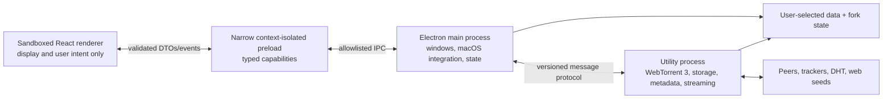

# Maintained WebTorrent Desktop fork: modernization plan

Status: **approved; migration in progress**

Research snapshot: **2026-07-24**

Working branch: `feat/webtorrent-updated`

Migration approved by the repository owner: **2026-07-24**

## 1. Purpose and approval boundary

This document makes the product, architecture, dependency, security, platform,
testing, release, and maintenance decisions for turning this repository into a
maintained WebTorrent Desktop fork. It is intentionally more specific than a
roadmap and less granular than a file-by-file implementation checklist.

The repository owner explicitly approved this plan and instructed the migration
to begin on 2026-07-24. Future amendments remain explicit decisions recorded in
this document.

Approval authorizes the local migration, dependency installation, packaging,
and tests on this branch. Release, merge, upstream submission, and use of
publishing credentials remain separately controlled actions.

### Decision vocabulary

- **Decided**: the migration will follow this choice unless this plan is
  explicitly amended.
- **Acceptance gate**: the primary choice is decided, but must prove a named
  property early. The fallback is also decided in advance.
- **Owner input**: a product identity, credential, account, budget, or policy
  value that cannot be inferred from the code.
- **Deferred**: intentionally excluded from the first maintained release, not
  forgotten.

## 2. Executive judgment

The maintained fork is feasible. The repository contains roughly 9,400 lines
of application JavaScript, so its size is not the central problem. Its age has
instead concentrated risk at nearly every trust boundary:

- the public release is from 2020 even though the source branch later received
  hundreds of mostly automated dependency commits;
- macOS packaging is explicitly Intel-only;
- non-x64 update architecture detection falls through to `ia32`;
- Electron 27 is end-of-life;
- WebTorrent 1.9 predates the current ESM, WebRTC, storage, and streaming APIs;
- renderers have unrestricted Node and Electron access;
- `@electron/remote` and an arbitrary IPC relay erase process boundaries;
- the development start command disables Chromium’s sandbox globally;
- Spectron is deprecated;
- release automation uses Node 16 and retired artifact actions;
- signing, notarization, update hosting, and platform metadata are obsolete or
  tied to the original project;
- the dependency tree contains abandoned casting packages, a Git-branch
  dependency, deprecated packaging modules, and pre-modern React UI code; and
- torrent metadata is untrusted input that can influence filesystem paths.

This is therefore a replatform, not a version bump or an Apple Silicon flag
change.

The central migration risks are native WebRTC packaging, two-phase metadata and
safe storage, tracker/web-seed egress mediation, resume behavior, legacy-data
import, and packaged-app testing on Apple Silicon.

## 3. What actually breaks Apple Silicon

Electron has shipped Apple Silicon binaries since Electron 11. The current
failure is application packaging and architecture handling, not a fundamental
Electron limitation.

The concrete causes in this repository are:

1. The macOS packaging script requests `x64` only.
2. Architecture mapping treats every non-x64 machine as `ia32`.
3. The packaging scripts and local launch workflow predate current Apple
   Silicon Electron behavior.
4. Electron 27 and its embedded Chromium/Node stack are unsupported.
5. Current WebTorrent brings native WebRTC code that must be packaged, loaded,
   and tested for arm64.
6. Existing automation does not build or launch an Apple Silicon artifact.

The pinned upstream issue, unofficial ARM fork, and open upstream PR are useful
evidence but are not suitable migration bases:

- [Pinned issue #2522](https://github.com/webtorrent/webtorrent-desktop/issues/2522)
  points to an unsigned ARM build and correctly demonstrates that native Apple
  Silicon packaging is possible.
- [The referenced `v0.25.0-arm64` fork release](https://github.com/gingergeek8192/webtorrent-desktop/releases/tag/v0.25.0-arm64)
  updates Electron and packaging enough to produce an ARM artifact, but retains
  WebTorrent 1.9, privileged renderers, Spectron, old CI, inherited branding,
  and broad package-manager overrides. Its release is labeled 0.25 while assets
  still identify as 0.24.
- [Upstream PR #2509](https://github.com/webtorrent/webtorrent-desktop/pull/2509)
  changes the macOS target from x64 to arm64, but does not modernize the engine,
  security model, dependencies, tests, or build system.

Decision: use those changes as research, not as a branch to merge or a fork to
base this work on.

## 4. Scope of the first maintained personal build

### 4.1 Required functional scope

The first maintained build preserves the useful desktop-client surface on the
owner’s current M-series Mac:

- add torrents from magnet links, info hashes, local `.torrent` files, and
  bounded remote `.torrent` URLs;
- create and seed a torrent from a selected file or directory;
- start, pause, resume, remove, and delete torrents;
- select files and prioritize playback;
- stream supported audio and video with seek/range support;
- handle external subtitle files and embedded audio-track selection where the
  runtime supports it;
- inspect audio metadata and embedded artwork within strict size limits;
- open media in a user-selected external player;
- watch a user-selected folder for `.torrent` files;
- preserve macOS menu, dock, power-save, notification, and startup behaviors;
- register magnet and `.torrent` capabilities without silently taking over OS
  defaults;
- import legacy WebTorrent Desktop settings and torrent history safely; and
- produce a native arm64 application that launches and works on the owner’s
  machine.

### 4.2 Intentional first-release removals

These are explicit risk reductions:

- **AirPlay, Chromecast, and DLNA casting are removed.** Their three direct
  libraries and discovery/protocol trees are abandoned or stale. Casting may
  return only as a separately designed, hardware-tested feature.
- **uTP is disabled.** WebTorrent’s optional `utp-native` 2.5.3 module is stale
  and has an unresolved connection-pool hang report. TCP and WebRTC remain.
- **Local Service Discovery and automatic port mapping are disabled.** Start
  both clients with `lsd: false`, `natUpnp: false`, and `natPmp: false`.
  Reintroduction is a separately disclosed, network-tested feature; it is not
  an implicit default inherited from WebTorrent.
- **Automatic video-frame poster extraction is deferred.** Embedded artwork,
  bounded image extraction, saved legacy posters, and generic media art remain.
  A future sandboxed media worker can restore video thumbnails.
- **Inherited telemetry, remote crash upload, and announcements are removed.**
  No request is sent to the original `webtorrent.io` endpoints.
- **All non-Apple-Silicon targets are out of scope.** No Intel macOS, Windows,
  Linux, universal binary, or cross-platform compatibility work is required.
- **Bundled sample torrents are not inserted on fresh installs.** The app opens
  to an empty state; deterministic synthetic torrents replace public swarms in
  tests. Imported legacy samples remain ordinary user entries.
- **Pure BitTorrent v2 and hybrid torrents are not supported or advertised.**
  The engine is explicitly BitTorrent v1 until upstream WebTorrent supports
  BEP 52.

### 4.3 Deliberate non-goals

- no visual redesign during migration;
- no search, catalog, RSS, remote-control, account, sync, or library feature;
- no browser extension;
- no App Store submission or public distribution pipeline;
- no code-signing certificate, notarization, update hosting, or automatic
  updater;
- no mobile build;
- no replacement of WebTorrent with libtorrent or another engine;
- no attempt to add BEPs that current WebTorrent does not support;
- no anonymous or privacy-network claims; and
- no automatic import that mutates or deletes the original app’s data.

Accessibility corrections, secure dialogs, and platform-native behavior are
allowed even when they cause small visual differences.

## 5. Local identity and version line

The personal fork still needs a different local identity so it cannot overwrite
the original app’s settings.

Decisions:

- Use `WebTorrent Updated` as the display name and
  `local.webtorrent-updated.desktop` as its separate bundle identity.
- Use a new application-data directory. Never point the fork at the original
  writable `WebTorrent` data directory.
- Preserve the MIT license and original copyright/author history.
- Start at `1.0.0-dev` and use ordinary SemVer for local builds. There are no
  beta/stable channels or platform-specific updater versions.
- Maintain an integer persisted-data `schemaVersion` independently from the
  application version.
- Keep a fork-specific peer client code so it does not impersonate upstream.

## 6. Runtime and toolchain baseline

Versions below are a research snapshot, not floating ranges. Immediately after
migration approval, versions are rechecked once against current stable
releases, recorded in the lockfile, and then exact-pinned.

| Area | 2026-07-24 snapshot | Decision |
| --- | --- | --- |
| Electron | 43.2.x; current supported line | Start on the latest stable patch available at migration kickoff and qualify it on the owner’s Mac. |
| Development Node | 24.18.0 LTS | Pin Node 24 LTS in developer metadata and local tooling. Reassess Node 26 only after it becomes LTS and the toolchain supports it. |
| Package manager | npm 11.16.0 bundled with Node 24.18 | Keep bundled npm 11.16.0 and lockfile v3. Use `npm ci`; do not introduce Bun, pnpm, Yarn, Corepack, a separately installed npm, or newly released npm 12 during migration. |
| WebTorrent | 3.0.16 | Migrate to the latest qualified WebTorrent 3 patch, exact-pinned. |
| Electron Forge | 7.11.2 stable; Forge 8 alpha | Use Forge 7 stable for the local arm64 app, native unpacking, and fuses. |
| Build | Vite 8.1.x | Bundle renderer and Electron entries with Vite. |
| Language | TypeScript 6.0.x | Strict TypeScript for application source; defer TypeScript 7 until `typescript-eslint` officially supports it. |
| UI | React 19.2.x | Use `createRoot` and modern JSX; do not add a UI framework. |
| Unit/component test | Vitest 4.1.x | Replace Tape and use React Testing Library for components. |
| Desktop E2E | WebdriverIO 9 + Electron service 10 | Replace Spectron. Playwright’s Electron API remains experimental and is not selected. |
| Lint/format | ESLint 10 flat config + Prettier 3 | Replace Standard/Babel ESLint. Add React Hooks rules and Knip dependency checks. |

### 6.1 Forge/Vite integration gate

Primary choice: run exact-pinned Vite 8 directly and feed its outputs to Forge
7 packaging through small, owned Forge lifecycle hooks. Do not use
`@electron-forge/plugin-vite`: the stable Forge 7.11 line is coupled to the
Vite 5 generation, while the Forge line that explicitly moved the plugin to
Vite 8 is still alpha.

Controls:

- all Forge packages are exact-pinned to one version and updated as a group;
- Vite and Forge minor upgrades are manually reviewed;
- development startup waits for main, preload, utility-process, and renderer
  outputs before launching Electron, and owns cleanup/HMR behavior explicitly;
- main, preload, utility-process, renderer, and packaged production outputs are
  exercised in the first toolchain milestone; and
- Vite externalizes Electron and native runtime modules instead of embedding
  binary addons into JavaScript bundles.

If direct Vite integration finds a release-blocking defect, first move to the
latest supported patch of the same Vite major, then the newest still-supported
Vite major. Changing Forge major, adopting electron-builder, or adopting a
second bundler requires an explicit amendment to this plan.

## 7. Target process architecture

The current hidden WebTorrent renderer exists for performance but combines DOM,
Node, filesystem, networking, and unrestricted Electron access. The replacement
separates those responsibilities.

### 7.1 Main process

The main process owns:

- application and window lifecycle;
- the custom application protocol;
- menus, dialogs, notifications, tray, dock, taskbar, power-save, and external
  player launching;
- file and protocol activation;
- startup registration and folder watching;
- persisted configuration and legacy import;
- validation and authorization of renderer requests;
- starting, supervising, and stopping the engine utility process; and
- redacted local diagnostics.

It does not own torrent protocol state or expose general Electron APIs to the
renderer.

### 7.2 UI renderer

Use one normal application renderer:

- call `app.enableSandbox()` before readiness so sandboxing is inherited by
  every renderer, including any accidentally added later;
- `nodeIntegration: false`;
- `contextIsolation: true`;
- `sandbox: true`;
- no `@electron/remote`, `ipcRenderer`, filesystem, process, child-process, or
  network imports;
- no `webview`;
- strict production CSP without `unsafe-eval`;
- navigation locked to the fork’s custom application origin;
- new-window requests denied;
- permission requests denied unless a future feature explicitly introduces one;
  and
- external links opened only through an HTTPS allowlist and main-process
  validation.

The About screen becomes a native About panel or a route in the same sandboxed
renderer. There are no privileged About or hidden WebTorrent browser windows.

### 7.3 Preload bridge

The preload exposes a small `window.desktop` capability API. It does not expose
raw `ipcRenderer`, Electron objects, event objects, arbitrary channel names, or
generic “send” methods.

Every command and event:

- has a named schema;
- is validated at runtime with Zod 4;
- has a TypeScript type inferred from that schema;
- carries a protocol version where it crosses the engine boundary;
- returns serializable plain data; and
- has bounded sizes and explicit error codes.

Main validates the sender URL and frame for every renderer-originated IPC call.
Subscriptions return an unsubscribe function and strip the Electron event
argument.

### 7.4 Engine utility process

Use `utilityProcess.fork()` for an ESM Node process. It owns:

- WebTorrent, `parse-torrent`, and `create-torrent`;
- separate public and private WebTorrent clients behind one app registry;
- TCP, WebRTC, DHT, tracker, receive-side PEX, and policy-mediated web-seed
  traffic;
- torrent lifecycle and a map keyed by info hash;
- file selection and piece/resume state;
- storage-path validation and payload I/O;
- torrent-file and resume-sidecar writes;
- audio metadata and bounded artwork extraction; and
- an app-owned, per-file loopback media proxy.

The utility process is crash containment, not an OS security sandbox. It has
network and filesystem authority by design, so torrent input validation remains
a release-critical boundary.

Add/remove/destroy operations are serialized per info hash. Commands are
idempotent where practical, include generation identifiers, and never depend on
WebTorrent’s asynchronous `client.get()` as the authoritative app registry.
The registry records which client owns each torrent. Known private torrents use
a client created with `dht: false`, `lsd: false`, and `utPex: false`; public
torrents use the public client. LSD is disabled in both clients for the first
release.

Main supervises the process. One unexpected exit triggers a clean restart and
state reconstruction; repeated exits enter a visible stopped state rather than
an infinite crash loop. A crash never authorizes data deletion.

### 7.5 State ownership

Separate three kinds of state:

1. **Durable state in main**: preferences, window bounds, torrent manifests,
   selections, resume references, playback history, and schema version.
2. **Runtime torrent state in engine**: WebTorrent objects, peers, bitfields,
   streams, sockets, speeds, and progress.
3. **Ephemeral UI state in renderer**: current route, selection, modal, menus,
   controls, and presentation-only state.

Use React’s reducer/context and `useSyncExternalStore` primitives instead of
adding Redux, Zustand, or another global-store dependency during migration.
Progress DTOs are intentionally compact and rate-limited; no WebTorrent class,
stream, error, or private bitfield object crosses IPC.

## 8. Electron security baseline

### 8.1 Application content

- Register a secure, standard `app://` scheme before app readiness.
- Remove `--no-sandbox` from every development, test, and production launch;
  fix runner configuration instead of disabling the process sandbox.
- Package production code in ASAR and load only from the application scheme.
- Separate development CSP from a strict production CSP.
- Disable navigation and popups, including redirects.
- Deny session permission, certificate, and authentication requests unless a
  documented feature requires them.
- Validate all paths and URLs in main or engine, never only in renderer code.
- Use `shell.openExternal` only for validated `https:` URLs; reject credentials,
  control characters, file URLs, and unexpected schemes.
- Never evaluate torrent names, tracker responses, update notes, logs, or error
  text as HTML.

### 8.2 Production Electron fuses

Final artifacts set and independently inspect:

- `RunAsNode = false`;
- `EnableNodeOptionsEnvironmentVariable = false`;
- `EnableNodeCliInspectArguments = false`;
- `EnableEmbeddedAsarIntegrityValidation = true`;
- `OnlyLoadAppFromAsar = true`;
- `EnableCookieEncryption = true`;
- `GrantFileProtocolExtraPrivileges = false`; and
- the current safe default for the remaining Electron fuses, with any change
  documented in the release review.

The normal test build may keep inspection available where WebdriverIO requires
it. A separately packaged local production-fuse app must still pass launch,
protocol, and playback smoke tests on the owner’s Mac.

### 8.3 Threat model

Treat all of the following as untrusted:

- `.torrent` bytes and magnet parameters;
- torrent file names, paths, counts, lengths, piece geometry, trackers, and web
  seeds;
- peers, DHT, PEX, tracker, WebRTC signaling, and HTTP responses;
- downloaded media, subtitles, images, and tags;
- remote torrent URLs and redirects;
- dropped files and OS activation arguments;
- legacy config, cached `.torrent` files, posters, and resume data;
- renderer messages if the UI is compromised.

The security goal is containment and least authority, not anonymity. Torrent
peers can see IP addresses, protocol encryption is not a VPN, and this must be
clear in user-facing documentation.

## 9. WebTorrent 3 and protocol decisions

### 9.1 What the upgrade provides

Move from WebTorrent 1.9.7 to the latest qualified 3.x patch. WebTorrent 3 is
ESM-only and requires Node 22 or newer. It supplies current:

- WebRTC support in Node through `webrtc-polyfill`;
- W3C-like file and stream APIs;
- client-wide streaming server APIs, used only as research because the fork
  serves files through its stricter proxy;
- tracker, store, selection, and connection fixes;
- current protocol submodules;
- performance and port-exhaustion fixes; and
- resume-bitfield support.

The official BEP matrix does **not** show newly supported BEPs between the
current desktop engine and WebTorrent 3. The value is implementation
maintenance and correctness, not BitTorrent v2.

### 9.2 Advertised protocol scope

Supported:

- BitTorrent v1 info hashes;
- magnet metadata exchange;
- DHT (IPv4) for public torrents, policy-mediated trackers and web seeds,
  receive-side PEX, private torrents, file selection, TCP peers, and WebRTC web
  peers; and
- BEP 53 selected-file parameters when no saved app selection exists.

Not supported or claimed:

- BEP 52 BitTorrent v2 or hybrid torrents;
- IPv6 DHT/tracker support;
- BEP 44 mutable torrents; and
- uTP or LSD in the first maintained release.

Pure v2 and hybrid metadata receive a clear unsupported-format error before
storage is constructed. Do not silently treat an unqualified hybrid torrent as
v1.

Set WebTorrent’s `secure: 1` default explicitly. It prefers an encrypted
BitTorrent handshake and falls back for compatibility; it does not encrypt
torrent payloads, conceal peer IP addresses, or provide privacy or anonymity.
Outgoing PEX advertisement is not claimed while upstream
[issue #2919](https://github.com/webtorrent/webtorrent/issues/2919) remains;
the fork consumes valid PEX peers received from remote peers.

### 9.3 Peer identity

- Replace the `-WD` peer prefix with a fork-specific two-character client code
  chosen with the product identity.
- Keep the Azureus-style version encoding and random per-session suffix.
- Set a fork name/version user agent without impersonating upstream.
- Do not persist a stable peer identifier across launches.

### 9.4 Native WebRTC

WebTorrent 3 is not a pure-JavaScript runtime when Node-side WebRTC is kept.
Its current chain is:

`webtorrent` → `@thaunknown/simple-peer` → `webrtc-polyfill` →
`node-datachannel`.

`node-datachannel` is an N-API native module with published macOS arm64
support. Other published platforms are irrelevant to this fork’s scope. The
fork retains WebRTC because connecting browser and normal BitTorrent peers is a
defining WebTorrent Desktop behavior. Native arm64 loading, ASAR unpacking, and
an actual browser-WebRTC transfer on the owner’s Mac are completion gates.

Treat the entire WebRTC chain as one qualified update unit. At migration
kickoff, record the exact resolved `@thaunknown/simple-peer`,
`webrtc-polyfill`, and `node-datachannel` versions and hashes. The local install
must find the reviewed macOS arm64 prebuilt binary and fail closed if it is
missing. An implicit source-build fallback is not allowed; any source build
must be deliberate and pinned.

`node-datachannel` is MPL-2.0. Retain its license and exact source
correspondence locally. If the app is ever distributed, provide the covered
source and other required notices before doing so.

### 9.5 uTP

Instantiate WebTorrent with `utp: false`. Ensure `utp-native` is absent from
shipped application resources even if npm installs the optional package while
building. Do not use a global `--omit=optional` install because current build
tools also use platform-specific optional packages.

Reintroduction requires:

- an actively maintained implementation;
- package/load tests on every advertised architecture;
- long-running connection and shutdown tests;
- no regression of WebRTC/TCP behavior; and
- a per-platform capability fallback that cannot crash the engine.

Track the upstream
[uTP connection-pool hang report #2890](https://github.com/webtorrent/webtorrent/issues/2890).

### 9.6 Lifecycle and public API adaptations

Decisions:

- pass tracker configuration through supported constructor/torrent options,
  not `globalThis.WEBTORRENT_ANNOUNCE`;
- own one registry across the separate public/private clients and account for
  asynchronous `client.get()`;
- do not expose `client.createServer()` or `torrent.createServer()` directly;
  stream selected files through the app-owned media proxy;
- use public W3C file APIs and async iterators;
- use bounded `arrayBuffer()` only for small metadata/artwork;
- derive piece boundaries from public lengths and `pieceLength`, never
  `_startPiece` or `_endPiece`;
- remove `getFileModtimes()` entirely;
- represent progress and availability with app-owned DTOs;
- write `torrent.torrentFile` `Uint8Array` data atomically; and
- serialize lifecycle operations to contain the known
  [add/remove race report #2685](https://github.com/webtorrent/webtorrent/issues/2685).

No migration decision depends on an unmerged upstream change.

### 9.7 Torrent ingestion policy

Every torrent begins deselected. The engine must not construct disk-backed
storage until raw metadata and paths have passed validation.

Accepted inputs:

- local `.torrent` files read through a main-authorized path;
- magnet links with v1 `btih` identifiers;
- raw v1 info hashes;
- remote `.torrent` URLs fetched by the application; and
- files/directories explicitly selected for torrent creation.

Limits:

- `.torrent` or metadata payload: 10,000,000 bytes;
- files per torrent: 100,000;
- complete UTF-8 file path: 4,096 bytes;
- individual UTF-8 path segment: 255 bytes;
- lengths and piece counts: safe integers with internally consistent geometry;
  and
- remote fetch: bounded redirects, response bytes, and time.

Remote torrent fetches accept `https:` by default. `http:` requires an explicit
advanced preference and confirmation. Reject embedded credentials, unexpected
ports where policy requires it, `file:`, `data:`, `javascript:`, and all other
schemes. Block loopback, link-local, cloud-metadata, and private-network
destinations by default, including redirects. A separately labeled
private-network mode may allow LAN torrent sources and trackers.

Local and remotely fetched `.torrent` bytes are decoded and validated before
they are passed to either disk-backed client. Validation examines the raw
bencoded `info.name`, `info.name.utf-8`, and every raw
`info.files[].path`/`path.utf-8` component before using `parse-torrent`’s
normalized `files` view. It then requires a one-to-one match between the raw
components and the canonical manifest. Reject any raw `meta version`, `file
tree`, or top-level `piece layers` field, including in an otherwise usable
hybrid torrent.

Magnets and raw info hashes use a two-phase flow because WebTorrent constructs
its store before it emits `metadata`:

- parse parameters before adding;
- discard `xs` exact-source URLs rather than allowing WebTorrent to fetch them;
- preserve BEP 53 `so` selection;
- reject impossible or excessive selection expressions;
- acquire metadata in a disposable client with no filesystem-backed store;
- default that client to tracker-only discovery with `dht: false`,
  `lsd: false`, and `utPex: false`;
- require a specific warning and user consent before public DHT metadata
  discovery for a trackerless magnet or raw info hash;
- destroy the staging torrent after bounded metadata acquisition;
- validate the recovered raw torrent bytes; and
- add only validated v1 bytes to the appropriate disk-backed public or private
  client.

If consented public DHT discovery later reveals a private flag, report that the
info hash has already been exposed, do not silently continue, and require a
tracker-bearing magnet or `.torrent` source for a privacy-preserving retry.
Metadata timeout, byte, peer, and resource limits apply to the staging client.

Saved selections are keyed by normalized file path, not array index. A saved
selection wins over BEP 53. BEP 53 applies only when no saved selection exists.
A missing or mismatched saved manifest leaves all files deselected and asks the
user to review the selection.

Private torrents:

- retain the private flag;
- require at least one tracker when created;
- do not receive global trackers;
- run only in the dedicated client created with `dht: false`, `lsd: false`,
  and `utPex: false`;
- never silently convert to a public torrent.

Keep WebTorrent's built-in tracker client disabled with `tracker: false`.
Implement the first release's HTTP(S) and WSS tracker protocols in narrow
app-owned engine modules instead of patching, forking, or vendoring
`bittorrent-tracker`. The stock client cannot enforce this plan's bounded
redirect/body/parser rules or WSS socket isolation without a broad,
version-sensitive rewrite. UDP and cleartext WS trackers are disabled.

Every enabled tracker connection plus HTTP(S) web seeds must pass the
app-owned egress policy at actual resolution/connection and redirect time.
Ingestion-time URL checks alone are insufficient. Enforce scheme, resolved
address, redirect, port, timeout, and byte policy in each owned transport. A
transport that cannot be mediated is disabled rather than bypassing the rule.
Private/link-local/loopback targets remain unavailable unless private-network
mode is explicitly enabled.

### 9.8 Filesystem containment

Do not wait for an upstream fix to
[WebTorrent issue #3012](https://github.com/webtorrent/webtorrent/issues/3012).
Use two defenses:

1. validate raw bencoded path components and the canonical parsed manifest
   before calling WebTorrent with a writable path; and
2. enforce the same root constraint at the app-owned chunk-store boundary.

Reject a torrent if any path contains or produces:

- NUL or control characters;
- absolute POSIX paths;
- Windows drive, UNC, or device paths;
- `.` or `..` segments after treating both slash styles as separators;
- empty segments where normalization changes identity;
- Windows reserved device names;
- Windows-forbidden characters or trailing dots/spaces;
- a path longer than the fixed limits;
- exact normalized collisions;
- Unicode-normalized or case-folded collisions on every platform;
- an existing nested symlink, junction, or reparse point; or
- a resolved path outside the selected download root.

Reject rather than rename unsafe torrent entries. Silent sanitization can cause
two metadata paths to target one disk path and makes cross-client behavior
ambiguous.

Before creates, writes, moves, exports, and deletions:

- resolve from a canonical authorized root;
- verify each existing parent component immediately before the operation;
- use no-follow and handle-relative operation semantics where the platform
  exposes them, and fail closed when a detected race changes identity;
- perform no operation outside that root;
- treat downloaded names as display text, not shell input; and
- use recoverable OS trash for user-requested payload deletion where available.

Removing a torrent and deleting its payload are separate explicit actions.
Neither action follows arbitrary symlinks or deletes the containing download
directory unless that directory is exactly the torrent-owned root and passes
the safety check.

Hostile-path, collision, symlink, reserved-name, zero-length, and large-count
fixtures are release blockers.

Threat-model boundary: another process already running as the same macOS user
can race path checks where Node does not expose complete handle-relative or
no-follow APIs. Such an actor already has the user’s filesystem authority and
is outside the hard containment claim. The app still revalidates at operation
time and tests all races it can detect.

### 9.9 Resume model

Do not carry forward the undocumented `fileModtimes` shortcut and never set
`skipVerify` automatically.

For each torrent, persist an app-owned resume sidecar containing:

- resume schema version;
- v1 info hash;
- normalized file manifest;
- piece length/count and total length;
- selected paths;
- compact completed-piece bitfield;
- root and file stat fingerprints;
- clean-shutdown marker; and
- checksum over the sidecar fields.

Write sidecars atomically and debounce ordinary updates. On startup, pass
WebTorrent’s public `bitfield` only when schema, info hash, file manifest, piece
geometry, checksum, clean-shutdown state, and stat fingerprints all match.
Otherwise perform a full verification.

Legacy torrents receive one full hash check on their first successful import.
Only then is a new sidecar produced. A missing, changed, truncated, or corrupt
file invalidates the entire fast-resume bitfield under this all-fingerprints
must-match design. The bitfield is a local performance hint, not an adversarial
integrity guarantee.

The UI distinguishes “checking,” “downloading,” “seeding,” “paused,”
“missing files,” and “error.” It must not show a torrent as complete merely
because legacy JSON says it was complete.

### 9.10 Streaming proxy

Do not expose WebTorrent’s built-in Node server to the renderer. Its `origin`
option controls CORS headers rather than authorizing GET/HEAD, and possession
of a file URL can reveal index routes by truncating the shared pathname.

Use one app-owned engine-lifetime loopback proxy:

- bind explicitly to `127.0.0.1`, never all interfaces;
- authorize only that exact ephemeral port in the production renderer’s
  `media-src` CSP; do not allow a wildcard localhost port;
- mint an independent high-entropy, short-lived token for exactly one selected
  torrent file and map no client/torrent index routes;
- require an exact token route and expected Host header;
- reject any present Origin that is not the exact `app://` application origin;
- accept an absent Origin only for the packaged media-element request path
  proven by integration tests, where the unguessable token remains mandatory;
- permit only `GET`, `HEAD`, `OPTIONS`, and one bounded byte range;
- obtain the selected file stream from WebTorrent’s file API without forwarding
  raw server URLs; and
- revoke tokens on playback close, torrent removal, or engine restart.

The renderer receives only the complete opaque per-file URL. Test seeking,
concurrent playback tokens, cancellation, Unicode and reserved URL characters,
percent encoding, missing/reused/expired tokens, wrong Host, wrong or unexpected
Origin, index-path attempts, engine restart, and shutdown.

Because casting is deferred, the first release has no LAN-bound media server.
Any future cast implementation must use a separate short-lived proxy exposing
exactly one selected file behind a rotated token; it must never expose
WebTorrent’s torrent index.

### 9.11 Torrent creation

- Keep the existing single-file-or-directory creation UX.
- The UI may enumerate a preview, but the engine revalidates the chosen root.
- Pass the selected filesystem root to `client.seed` so seeding can use data in
  place instead of copying a pre-enumerated path list into a new store.
- Seed private torrents through the DHT-disabled private client. Do not treat
  the `client.seed()` callback/event as authoritative; WebTorrent 3.0.16 can
  wait for a DHT announcement that a private torrent never performs when the
  owning client has DHT. Drive UI completion from the returned torrent’s
  validated lifecycle/tracker state and retain a regression test.
- Preserve name, comment, tracker, private, and junk-filter controls.
- Validate trackers and private-torrent rules in the engine.
- Use current automatic piece sizing. A newly created large torrent may
  therefore have a different v1 info hash from one produced by the 2020 app;
  existing torrents remain unchanged.
- Save the generated `.torrent` atomically and offer export through a
  main-owned save dialog.

### 9.12 Upstream monitoring and containment

Known upstream soak targets include:

- [path traversal #3012](https://github.com/webtorrent/webtorrent/issues/3012);
- [deselected files creating folders #3015](https://github.com/webtorrent/webtorrent/issues/3015);
- [memory growth #2995](https://github.com/webtorrent/webtorrent/issues/2995);
- [outgoing PEX limitation #2919](https://github.com/webtorrent/webtorrent/issues/2919);
- [uTP hang #2890](https://github.com/webtorrent/webtorrent/issues/2890); and
- [add/remove async safety #2685](https://github.com/webtorrent/webtorrent/issues/2685).

Contain these in the app with validation, serialized operations, resource
limits, soak tests, and intentional feature degradation. If a true core blocker
appears:

1. submit a small reusable fix upstream;
2. do not block app work on its merge;
3. use a temporary fork commit only when unavoidable;
4. pin that commit, document the diff and license, and add a removal issue; and
5. return to a registry release as soon as the fix ships.

No floating Git dependency or branch reference is permitted.

## 10. Persistent data and legacy import

### 10.1 New state store

Use `electron-store` in the main process only, with Zod 4 as the runtime source
of truth. `electron-store` supplies Electron-aware location and atomic config
writes; application code owns schema versions and explicit migrations.

Persist:

- preferences;
- window bounds and non-sensitive UI settings;
- torrent identity, destination, selections, and status intent;
- references to cached `.torrent`, poster, and resume files;
- minimal playback history; and
- the integer `schemaVersion`.

Do not persist:

- peers, socket addresses, live speeds, streams, WebTorrent objects, or errors;
- a telemetry or stable peer identifier;
- update tokens or credentials;
- raw image/audio buffers in JSON; or
- absolute paths in modes advertised as portable.

Large or binary data lives in dedicated fork-owned directories. Configuration
migrations make a timestamped backup before writing and are idempotent.

### 10.2 Import behavior

On first launch, detect but do not open for writing the original WebTorrent
Desktop data directory. Offer:

- **Import**: copy supported settings and torrent metadata into the fork;
- **Start fresh**: leave the original app untouched; or
- **Later**: keep the prompt available from settings.

The importer is a new pure reader. It does **not** execute the old migration
module, because historical migrations rename payload directories, delete cached
files, reinstall handlers, and otherwise have side effects.

Import flow:

1. copy the legacy config and supporting metadata into a temporary staging
   directory;
2. parse with bounded tolerant legacy schemas;
3. map each known schema into the new canonical model;
4. validate all cached `.torrent` files and referenced posters;
5. copy valid cache files into fork-owned paths;
6. reference existing payload directories without moving or renaming them;
7. write the new state atomically;
8. retain an import report and backup; and
9. hash-check imported payloads before seeding or declaring completion.

Invalid entries are skipped with a report rather than aborting the whole
import. Unknown fields are not propagated. The old telemetry ID is discarded.
Original handler, startup, and update preferences are imported as UI choices
but are not activated until the user confirms them in the fork.

Rollback means deleting the new fork’s imported state and starting fresh; the
original app and payloads remain recoverable because they were never modified.

### 10.3 Installation mode

Support one normal per-user macOS application-data location. Windows portable
mode and portable-path semantics are removed.

## 11. UI modernization

### 11.1 React and TypeScript

- Upgrade React/React DOM to the latest qualified 19.2 patch.
- Use `createRoot` and the modern JSX transform.
- Convert application source to strict TypeScript by migration completion.
- Permit `allowJs` only as a migration bridge; the completion gate is no
  unchecked application JavaScript other than intentionally typed tool config.
- Replace PropTypes with TypeScript.
- Preserve class components when converting them adds no value; convert
  behavior-heavy or touched components to functions/hooks deliberately.
- Do not adopt React Server Components, a router framework, or React Compiler
  during this migration.

### 11.2 Material UI removal

The repository uses Material UI 0.20 in only a small number of files for five
basic widgets and theme colors. Do not replace it with MUI 9 and Emotion; that
would add a large runtime/styling stack and require a nine-major API migration.

Replace it with local accessible primitives:

- native button;
- native checkbox;
- labeled text/path field;
- progress element with an accessible value; and
- modal/dialog shell with focus management.

Use existing CSS plus a small set of CSS custom properties for light/dark theme
tokens. Preserve the current visual identity; this is not a redesign.

### 11.3 Renderer behavior

- Replace the global mutable dispatcher incrementally with typed domain events
  and reducer actions.
- Keep high-frequency engine progress separate from modal/navigation state.
- Use semantic controls and keyboard-visible focus.
- Preserve reduced-motion, high-contrast, screen-reader labels, and native
  title-bar constraints.
- Never use raw HTML for torrent names, metadata, subtitles, errors, or logs.
- Obtain dropped filesystem paths through the narrow preload `webUtils`
  capability; do not rely on the removed browser `File.path` behavior.

## 12. OS integration decisions

| Capability | Decision |
| --- | --- |
| Login at startup | Use Electron’s macOS login-item API. User opt-in only. |
| Magnet and `.torrent` handling | Declare capabilities in the local app bundle and use Electron APIs. Never silently become default. |
| Folder watching | Keep updated Chokidar in main; watch only a user-selected directory and debounce/validate discovered files. |
| External player | Keep the feature. Probe known paths and launch with `execFile`, never shell command strings. Allow an explicitly selected executable. |
| Notifications | Keep local OS notifications; sanitize text and respect user preference. |
| Menu/dock | Keep and test the macOS-specific menu and dock integrations. |
| Power-save blocker | Keep only while actively playing; release on pause, stop, crash, and exit. |
| Delete/trash | Main authorizes, engine validates roots, then use macOS Trash. Permanent deletion requires explicit confirmation. |
| About | Native About panel or sandboxed app route; no privileged window. |
| Logs | Rotating redacted local logs with an explicit export action. No automatic upload. |

## 13. Privacy and network policy

- Remove telemetry, announcement, and inherited crash-report requests.
- Do not generate or transmit a persistent analytics identifier.
- Start local crash reporting with upload disabled only if it materially
  improves diagnostics; let the user export logs/minidumps explicitly.
- Redact magnet queries, tracker passkeys, full local paths, peer addresses, and
  user names from ordinary logs.
- Do not log loopback stream tokens.
- Public DHT, trackers, receive-side PEX, TCP, and WebRTC are documented as
  network-visible torrent behavior. LSD is disabled.
- Set `natUpnp: false` and `natPmp: false` in the first maintained build. A later
  explicit opt-in may restore mappings only after router/lifecycle tests and a
  disclosure review; outbound TCP/WebRTC must not depend on that feature.
- Do not inherit `create-torrent`’s built-in announce list or
  `@thaunknown/simple-peer`’s implicit Google/Twilio ICE configuration.
  Created public torrents default to trackerless DHT operation; the UI explains
  that browser-peer reachability requires an explicit WSS tracker. ICE defaults
  to no third-party server, with an advanced user-configured STUN-only list.
  TURN credentials/relaying are deferred rather than stored or silently billed.
- If the owner later supplies or approves default tracker/ICE infrastructure,
  keep its exact endpoints in a reviewed, versioned policy—not a remotely
  mutable list—disclose each operator/purpose, and provide a disable control.
  Empty defaults remain the predetermined fallback.
- Block private-network remote torrent URLs, tracker endpoints, web seeds, and
  resolved redirect targets by default unless the user enables clearly labeled
  private-network mode.
- Strip magnet `xs` sources. Enforce scheme, resolved-IP, redirect, port, DNS,
  size, and timeout policy inside the actual remote-fetch/tracker/web-seed
  transport. Disable a transport if the app-owned adapter or pinned upstream
  patch cannot enforce the policy.

## 14. Dependency strategy

### 14.1 General policy

- Exact-pin every direct runtime and build dependency.
- Keep one npm lockfile v3 and use `npm ci`.
- Require Node 24.18.0, npm 11.16.0, Darwin, and arm64 through npm
  `devEngines`, strict engine checks, and a fail-fast command guard. Do not
  bootstrap a second toolchain from project scripts.
- No Git branches, floating Git tags, wildcard ranges, blanket overrides, or
  unexplained transitive pins.
- An override requires a linked upstream issue, rationale, owner, and removal
  condition.
- Keep all Forge packages on the same exact version.
- Isolate Electron, WebTorrent, Forge/Vite, React, and native-module upgrades in
  manually reviewed pull requests; never auto-merge them.
- Renovate opens a weekly dependency batch and immediate security updates.
- Review release notes, install scripts, native binaries, licenses, and
  transitive changes. Never run `npm audit fix` blindly.
- Run `npm audit signatures`, vulnerability review, and Knip in the local
  verification workflow.

### 14.2 New direct runtime dependencies

| Package/capability | Decision |
| --- | --- |
| `webtorrent` | Latest qualified 3.x patch; exact pin. |
| `parse-torrent` | Latest compatible 11.x patch; direct because import and validation use it. |
| `create-torrent` | Latest compatible 6.x patch; direct for creation, but never consume its built-in announce defaults as product policy. |
| `ws` | Exact 8.21.1 pin for the app-owned WSS tracker transport; no pooling, compression, redirects, or autonomous reconnect. |
| `@thaunknown/simple-peer` | Exact 10.1.1 pin for bounded app-owned tracker offers and the qualified WebTorrent WebRTC chain. |
| `react`, `react-dom` | Latest qualified 19.2 patch. |
| `zod` | Exact 4.4.3 pin for IPC, engine messages, config, and import schemas. |
| `electron-store` | Stable 11.x exact pin, main-only, wrapped by app schema/migrations. |
| `chokidar` | Stable 5.x exact pin for the explicit folder-watcher feature. |
| `music-metadata` | Stable 11.x exact pin in engine for bounded metadata extraction. |
| `semver` | Stable 7.x exact pin, retained only for legacy-version and local application-version parsing. |
| `tinyld` | Stable exact pin for subtitle language detection. |
| `subtitle` | Exact 4.2 line for bounded SRT and a fixture-defined basic WebVTT cue subset. Reject unsupported WebVTT constructs clearly; do not claim full WebVTT conformance. |
| `pretty-bytes` | Stable exact pin for display formatting. |
| `debounce` | Exact 3.0 line for UI, watcher, and save coalescing only. Lifecycle-critical engine sequencing uses owned timers/queues. |

The WebTorrent transitive native `node-datachannel` dependency is recorded and
audited as if direct even though version selection currently comes through
WebTorrent. Add documented exact npm overrides for the qualified
`@thaunknown/simple-peer` → `webrtc-polyfill` → `node-datachannel` set so a
range refresh cannot silently replace the native binary; remove an override
only when the upstream packages themselves make the same exact, reviewed
selection. Keep its MPL license and exact corresponding source information with
the local build records so the binary can be traced and rebuilt.

### 14.3 Existing runtime dependency disposition (35/35)

| Existing package | Current | Decision |
| --- | ---: | --- |
| `@electron/remote` | 2.1.3 | **Remove.** Narrow preload and validated IPC replace it. |
| `airplayer` | Git branch | **Remove.** AirPlay is deferred; floating Git dependencies are prohibited. |
| `application-config` | 2.0.0 | **Replace** with main-only `electron-store` plus app-owned schemas/import. |
| `arch` | 2.2.0 | **Remove.** Use `process.arch` and Electron’s translation APIs. |
| `auto-launch` | 5.0.5 | **Remove.** Use Electron login-item APIs and owned XDG integration. |
| `bitfield` | 4.1.0 | **Remove direct use.** WebTorrent owns its internal bitfield; IPC uses app DTOs. |
| `capture-frame` | 4.0.0 | **Remove.** Video-frame posters are deferred; bounded canvas capture can be owned later. |
| `chokidar` | 3.5.3 | **Retain/update** to maintained ESM 5.x for folder watching. |
| `chromecasts` | 1.10.2 | **Remove.** Chromecast is deferred pending a new hardware-tested design. |
| `create-torrent` | 5.0.9 | **Retain/update** to compatible ESM 6.x as a direct engine dependency. |
| `debounce` | 1.2.1 | **Retain/update** to exact 3.0 for UI/watch/save coalescing only; own lifecycle-critical timing. |
| `dlnacasts` | 0.1.0 | **Remove.** DLNA is deferred pending a new hardware-tested design. |
| `drag-drop` | 7.2.0 | **Remove/absorb.** Use DOM drag events and a narrow preload path capability. |
| `es6-error` | 4.1.1 | **Remove.** Native `Error` subclasses are sufficient. |
| `fn-getter` | 1.0.0 | **Remove.** Use normal ESM dynamic imports where lazy loading is justified. |
| `iso-639-1` | 2.1.15 | **Remove.** `tinyld` returns codes and `Intl.DisplayNames` supplies labels. |
| `languagedetect` | 2.0.0 | **Replace** with zero-dependency MIT `tinyld`. |
| `location-history` | 1.1.2 | **Remove/absorb.** Own the small navigation state in the application reducer. |
| `material-ui` | 0.20.2 | **Remove without framework replacement.** Use local accessible primitives. |
| `music-metadata` | 7.14.0 | **Retain/update** to compatible ESM 11.x in the engine. |
| `network-address` | 1.1.2 | **Remove/absorb.** A small `os.networkInterfaces()` helper is sufficient if casting returns. |
| `parse-torrent` | 9.1.5 | **Retain/update** to compatible ESM 11.x as a direct engine dependency. |
| `prettier-bytes` | 1.0.4 | **Replace** with maintained ESM `pretty-bytes`. |
| `prop-types` | 15.8.1 | **Remove.** TypeScript replaces runtime PropTypes. |
| `react` | 17.0.2 | **Retain/update** to the latest qualified 19.2 patch. |
| `react-dom` | 17.0.2 | **Retain/update** to the latest qualified 19.2 patch and `createRoot`. |
| `rimraf` | 4.4.0 | **Remove.** Node 24 `fs.rm` covers the limited uses. |
| `run-parallel` | 1.2.0 | **Remove.** Use structured async operations/`Promise.all`. |
| `semver` | 7.3.8 | **Retain/update** for legacy and release version parsing. |
| `simple-concat` | 1.0.1 | **Remove.** Use `node:stream/consumers` with size limits. |
| `simple-get` | 4.0.1 | **Remove.** Use Electron `net.fetch` or bounded engine fetch. |
| `srt-to-vtt` | 1.1.3 | **Replace** with `subtitle` for SRT and the explicitly tested basic WebVTT subset. |
| `vlc-command` | 1.2.0 | **Remove/absorb.** Probe/launch safely with `execFile`; avoid shell strings and its `winreg` path. |
| `webtorrent` | 1.9.7 | **Retain/migrate** to latest qualified 3.x; this is the central engine migration. |
| `winreg` | 1.2.4 | **Remove.** Installer metadata and Electron APIs own associations. |

### 14.4 Existing development dependency disposition (21/21)

| Existing package | Current | Decision |
| --- | ---: | --- |
| `@babel/cli` | 7.29.7 | **Remove.** Vite/TypeScript own compilation. |
| `@babel/core` | 7.29.7 | **Remove.** Vite/TypeScript own compilation. |
| `@babel/eslint-parser` | 7.29.7 | **Remove.** `typescript-eslint` parses source. |
| `@babel/plugin-transform-react-jsx` | 7.29.7 | **Remove.** Vite React plugin uses the modern JSX transform. |
| `cross-zip` | 4.0.0 | **Remove.** The personal build produces no ZIP archive. |
| `depcheck` | 1.4.7 | **Replace** with maintained Knip; the original project is archived. |
| `electron` | 27.3.11 | **Retain/update** to the latest qualified stable patch and exact-pin. |
| `electron-notarize` | 1.2.2 | **Remove.** Notarization is outside this personal-build scope. |
| `electron-osx-sign` | 0.6.0 | **Remove.** No Developer ID signing is required; use ad-hoc signing for the local app. |
| `electron-packager` | 17.1.2 | **Remove direct use.** Forge consumes maintained `@electron/packager`. |
| `electron-winstaller` | 5.4.4 | **Remove.** Windows packaging is out of scope. |
| `gh-release` | 7.0.2 | **Remove.** The personal build has no release-publishing workflow. |
| `minimist` | 1.2.8 | **Remove.** The bespoke packaging CLI is retired. |
| `nodemon` | 2.0.22 | **Remove.** Forge/Vite own development watching. |
| `open` | 8.4.2 | **Remove.** App-mediated path/URL opening replaces helper scripts. |
| `plist` | 3.1.1 | **Remove.** Forge packager config owns application metadata. |
| `pngjs` | 7.0.0 | **Remove direct use.** WebdriverIO visual service owns image comparison. |
| `run-series` | 1.1.9 | **Remove.** Forge lifecycle and async functions replace it. |
| `spectron` | 19.0.0 | **Replace** with WebdriverIO and `@wdio/electron-service`. |
| `standard` | 17.0.0 | **Replace** with ESLint 10 flat config and Prettier. |
| `tape` | 5.10.2 | **Replace** with Vitest. |

### 14.5 Existing optional dependency disposition (3/3)

| Existing package | Current | Decision |
| --- | ---: | --- |
| `appdmg` | 0.6.x | **Remove.** The personal build produces no DMG. |
| `electron-installer-debian` | 3.2.0 | **Remove.** Linux packaging is outside scope. |
| `electron-installer-redhat` | 3.4.0 | **Remove.** Linux packaging is outside scope. |

### 14.6 Selected development stack

Exact patches are rechecked once at migration approval.

| Area | Selected packages |
| --- | --- |
| Packaging | `@electron-forge/cli` 7.11 line for a local macOS arm64 `.app`; no installer maker initially |
| Forge controls | Forge auto-unpack-natives plus exact direct `@electron/fuses` 2.1.3 in an owned `packageAfterCopy` hook; do not use Forge 7’s fuses plugin because its `^1.0.0` peer cannot configure Electron 43’s complete fuse wire |
| Compilation | Standalone Vite 8.1 line invoked by owned Forge hooks, plus `@vitejs/plugin-react`; no Forge Vite plugin |
| Language/types | TypeScript 6.0; exact `@types/node`, `@types/react`, `@types/react-dom`, and `@types/semver`; Electron’s bundled declarations |
| Runtime schemas | Zod 4.4.3 exact pin |
| Lint | ESLint 10 flat config, `@eslint/js`, `typescript-eslint`, React Hooks rules |
| Formatting | Prettier 3.9 line |
| Dead code/deps | Knip 6.29 line |
| Unit/component | Vitest 4.1, jsdom, `@testing-library/react`, its explicit `@testing-library/dom` peer, `@testing-library/user-event`, and `@testing-library/jest-dom` |
| Desktop E2E | Aligned WebdriverIO 9.30 `webdriverio`, CLI, local runner, Mocha framework, spec reporter, Electron service 10.1, and visual service on one pinned runner |
| Torrent integration | A direct exact `bittorrent-tracker` dev dependency and generated local fixtures. The package remains transitively present in WebTorrent's production graph through `torrent-discovery`, but production code never constructs its tracker client or server. |

Do not install deprecated/stub `@types/electron`. WebTorrent 3,
`parse-torrent` 11, and `create-torrent` 6 do not provide reliable declarations
for this migration; define a narrow app-owned engine-adapter type surface for
only the APIs consumed. Compile fixtures and runtime contract tests must prove
that surface against each exact package update before it lands.

Do not add `eslint-plugin-react` until its stable peer range includes the
selected ESLint major. TypeScript covers props, the hooks plugin covers hook
correctness, and ESLint 10 handles JSX reference tracking.

### 14.7 Initial audit disposition

The migration baseline's exact audit results, reachability analysis, accepted
build-tool debt, and mitigations are recorded in
[`docs/dependency-audit.md`](docs/dependency-audit.md).

The `ip.isPublic` advisory inherited through WebTorrent is not reachable: the
application is a tracker client, the sole transitive `ip` use is inside the
tracker-server UDP parser, and that parser uses `ip.toString`, not the
vulnerable function. npm's proposed downgrade to WebTorrent 0.7.3 is rejected.

Forge 7's `tar`, `tmp`, and exact-commit `@electron/node-gyp` Git paths are
accepted temporarily as local, development-only toolchain debt because no
fixed stable Forge line exists. They are pruned from the application, receive
no untrusted application input or credentials, and must be removed when a
compatible stable Forge release fixes the paths. This is an explicit
exception, not permission to ignore new audit findings, switch to a major
prerelease solely to reduce an audit count, or run blind overrides.

## 15. Build, package, and platform support

### 15.1 Supported machine

The only supported target is the owner’s current Apple Silicon Mac and its
installed macOS version. Build natively for `darwin-arm64`. Intel, universal,
Windows, Linux, older-macOS compatibility, and public support claims are out of
scope.

### 15.2 Local application

Produce one local `WebTorrent Updated.app` with Electron Forge. Do not create an
installer initially. The owner may copy the `.app` into `/Applications`.

No Apple Developer account, Developer ID certificate, notarization, or public
Gatekeeper acceptance is required. Ad-hoc-sign the complete local app after its
native modules are placed so macOS sees one internally consistent bundle. This
does not make it suitable for public distribution.

Verify on the owner’s Mac:

- the app and all Mach-O/native modules are arm64;
- the ad-hoc signature is internally valid;
- the packaged app launches outside the source checkout;
- app data is isolated from original WebTorrent Desktop;
- magnet and `.torrent` activation work if the owner enables them; and
- an actual browser-WebRTC transfer succeeds.

### 15.3 Native modules in the app

- Keep `node-datachannel` external to the Vite JavaScript bundle.
- Use Forge’s native-unpack support so `.node` binaries are outside ASAR.
- Verify the binary’s architecture and Node-API load in the final packaged app,
  not only in a development checkout.
- Ad-hoc-sign nested native code before ad-hoc-signing the enclosing `.app`.
- Ensure stale optional `utp-native` files are not packaged.
- Fail package verification if an unexpected native addon appears in the
  dependency inventory or ASAR/unpacked tree.

## 16. Updating the personal installation

Remove the inherited automatic updater and all original update endpoints. Do
not add an update server, release feed, channel system, or signing
infrastructure.

To update the personal installation:

1. pull or merge the maintained branch;
2. run the pinned install, test, and local-package commands;
3. quit the current app; and
4. replace `WebTorrent Updated.app` with the newly built copy.

Application state and payload references must survive this manual replacement.
Automated updates may be reconsidered only if the fork later becomes something
other people install.

## 17. CI and supply-chain design

### 17.1 Workflow separation

**Required local workflow**

- pinned Node/npm pair and `npm ci`;
- lockfile, format, lint, type, Knip, unit/component, and engine integration
  checks;
- native arm64 package, launch, WebRTC, playback, and persistence smoke tests;
  and
- no signing, publishing, update, or release credentials.

**Optional GitHub pull-request workflow**

- one Apple Silicon macOS job when a suitable hosted runner is available;
- the same deterministic checks that are useful outside the owner’s hardware;
- no Windows, Linux, or Intel matrix;
- no package publication; and
- no secrets.

### 17.2 GitHub Actions policy

Use the current stable `actions/checkout`, `actions/setup-node`, and npm cache
actions only where the optional workflow needs them. If diagnostics or a local
test package are uploaded, use the current `actions/upload-artifact` line
(version 7 in this research snapshot).

At migration time, select the current stable versions and pin every action to a
full commit SHA with a human-readable version comment. Renovate updates the SHA
through review.

`actions/upload-artifact@v3` is retired and must be removed. Use short retention
for any diagnostic artifact. Cache npm’s download cache only; never cache
`node_modules`.

Workflow permissions are explicitly read-only. No publishing, OIDC signing, or
long-lived token is needed.

### 17.3 Local build evidence

For each manually installed build, retain the application version/commit,
lockfile, arm64/native-addon inventory, Electron fuse inspection, test result,
and exact `node-datachannel` source/license correspondence. No SBOM,
attestation, notarization evidence, public checksums, or reproducible-build
claim is required for the personal installation.

## 18. Test strategy

### 18.1 Unit and component tests

Use Vitest plus React Testing Library. Cover:

- Zod command/event/config schemas;
- compile/runtime contracts for the narrow WebTorrent/parse/create adapter
  declarations;
- reducers and state selectors;
- raw bencoded path inspection, v2/hybrid rejection, normalization, collision,
  reserved-name, and root-containment rules;
- URL, redirect, private-network, tracker, and web-seed policy;
- legacy-config import for every historical schema family;
- resume-sidecar validation and corruption;
- file selection by normalized path and BEP 53 precedence;
- private-torrent configuration;
- piece-boundary/progress calculations, including zero-length and padding
  files;
- SRT and the accepted basic WebVTT subset, rejection of unsupported WebVTT,
  language labels, and unsafe text;
- redaction; and
- local accessible UI primitives, focus, keyboard, high-contrast, and reduced
  motion behavior.

### 18.2 Engine integration

Required tests use generated temporary data, a local tracker, local web seed,
and isolated temporary directories. They require no public swarm or external
network.

Cover:

- add/remove/pause/resume/destroy and duplicate commands;
- create and seed single-file, directory, and private torrents;
- TCP transfer;
- browser-WebRTC transfer through the packaged `node-datachannel` path;
- public DHT, trackers, receive-side PEX, and permitted web seeds in isolated
  fixtures; assert that LSD, UPnP, and NAT-PMP never start;
- tracker-only magnet metadata staging, consented DHT staging, and private
  client discovery isolation;
- actual DNS/redirect/address enforcement in every enabled tracker/web-seed
  transport;
- full and partial file selection;
- remote metadata limits;
- full verification and valid/invalid fast resume;
- changed, corrupt, moved, missing, and read-only files;
- per-file loopback-proxy playback, seek/range, cancellation, token/index
  isolation, and restart;
- engine crash/restart and command replay;
- deletion/trash isolation;
- hostile metadata and filesystem races; and
- no write before metadata validation.

No test deletes outside a uniquely created temporary root.

### 18.3 Electron end-to-end

Use WebdriverIO with `@wdio/electron-service`:

- first launch and empty state;
- legacy import success, partial failure, cancel, and rollback;
- add local file, magnet, and bounded URL;
- choose files, pause, resume, restart, and remove;
- create/export/seed;
- audio/video playback, seeking, volume, rate, subtitles, and external player
  handoff;
- preferences, folder watching, startup, and handler choices;
- macOS menus, dialogs, notifications, and dock behavior;
- malformed activation arguments and denied navigation/popups;
- manual app replacement with state preservation.

Functional and visual assertions target the owner’s Mac. Pin the visual
environment so ordinary macOS rendering changes do not create noise.

### 18.4 Final artifact tests

Tests must launch the actual packaged artifact, not only a Forge development
process:

- correct executable and native architecture;
- native WebRTC module load and transfer;
- no unexpected native modules;
- embedded ASAR integrity, `OnlyLoadAppFromAsar`, and the remaining production
  fuses;
- renderer security preferences;
- no `@electron/remote` or arbitrary IPC;
- local copy/install, launch, manual replacement, and data preservation;
- magnet/`.torrent` activation;
- startup behavior;
- arm64 architecture and ad-hoc signature checks;
- no inherited network endpoints; and
- no public-network requirement for the required suite.

### 18.5 Soak and resource tests

Run repeated add/remove/stream/restart cycles while recording:

- resident memory;
- heap trend;
- sockets and listening ports;
- file descriptors/handles;
- temporary files;
- engine process count; and
- shutdown duration.

Set measured budgets after the modern baseline is available. A monotonic leak
or orphaned listener/process blocks completion even if a fixed absolute threshold
has not yet been chosen.

## 19. Completion acceptance gates

The migration is complete only when all applicable gates pass.

### Functionality

- Required scope in section 4 works on the owner’s M-series Mac.
- Intentional removals are reflected in UI, docs, and tests; no dead buttons or
  stale menu items remain.
- Existing v1 torrents and payloads import without moves or deletion.
- Known-private torrents use only their declared trackers. Trackerless
  magnet/info-hash DHT preflight requires explicit exposure consent and never
  silently continues if the recovered metadata is private.
- WebRTC browser peers and normal TCP peers both interoperate.

### Security

- No production renderer has Node integration, remote, raw IPC, filesystem, or
  unrestricted navigation.
- Every renderer/main/engine message has a runtime schema and sender check.
- Hostile torrent paths cannot escape or collide in the selected root under the
  explicit same-user-race threat-model boundary.
- Every enabled remote-fetch/tracker/web-seed transport enforces the default
  SSRF policy at resolution/connection/redirect time.
- Loopback streams expose no index and reject wrong host, token, route, and any
  present unexpected origin.
- Production CSP and fuses are verified from the artifact.
- No unaccepted critical/high vulnerability applies to reachable production
  code.

### Data integrity

- Legacy import is read-only with backup, report, and rollback.
- Resume state never bypasses required verification after mismatch/crash.
- Remove versus delete is explicit.
- Destructive tests prove no operation can escape its authorized root within
  the defined threat model.
- Replacing the local `.app` preserves state and payload references.

### Local application

- The packaged application and native modules are arm64 and launch on the
  owner’s Mac.
- Required native `node-datachannel` binaries load from the packaged app.
- The final bundle has a valid ad-hoc signature and verified Electron fuses.
- `WebTorrent Updated` uses its own bundle ID and application-data directory.
- No updater, signing account, release host, Windows/Linux artifact, Intel
  artifact, or public-distribution evidence is required.

### Quality

- Lockfile install is deterministic on the owner’s Mac.
- Format, lint, type, unit, component, integration, E2E, package, security, and
  soak suites are green.
- Required tests use no public torrents.
- Known upstream issues have local containment or a documented release
  decision.
- README, privacy, local build, and maintenance documentation is current.

## 20. Migration sequence

This is milestone granularity, not a file-edit plan.

### Milestone 0 — approve and freeze the contract

- Owner reviews/amends this document and explicitly approves migration.
- Freeze `WebTorrent Updated`, its separate bundle ID, and its separate
  application-data directory.
- Capture current behavior and legacy fixtures without relying on public
  swarms.
- Establish the intentional-removal list as acceptance-test expectations.

Exit: **passed 2026-07-24** — explicit migration approval received.

### Milestone 1 — prove the Apple Silicon toolchain

- Establish Node/npm, TypeScript, Vite, Forge, and test baselines.
- Prove main/preload/renderer/utility builds in development and production.
- Package and load `node-datachannel` as arm64 on the owner’s Mac.
- Prove fuses and native-unpack behavior.
- Prove the standalone Vite/Forge integration and local `.app` packaging.

Exit: **passed 2026-07-24** — development and packaged arm64 shells launch;
Electron 43, Node 24, WebTorrent 3, and native WebRTC load in the utility
process; the sole native addon is verified arm64; and packaging, ASAR
integrity, fuses, ad-hoc signing, and the clean locked install pass. The
accepted audit findings are recorded in `docs/dependency-audit.md`.

### Milestone 2 — establish security/process boundaries

- Introduce custom protocol, sandboxed renderer, typed preload, validated IPC,
  and utility-process supervision.
- Move durable state authority to main.
- Remove remote/arbitrary IPC and privileged auxiliary windows.
- Establish redacted diagnostics and production security assertions.

Exit: **passed 2026-07-24** — the empty-shell app launches on the owner’s Mac
with a nonpersistent UI session, OS-sandboxed renderer, context-isolated typed
preload, exact frame-scoped and schema-validated IPC, main-owned versioned
state, redacted bounded diagnostics, and a supervised utility engine. Clean
development and packaged tests measure the committed React bootstrap, absent
renderer Node globals, an ephemeral UI session, OS sandboxing, denied
permissions/popups/navigation/network/WebRTC, native engine WebRTC readiness,
one automatic restart, second-crash containment, observed utility exit with no
orphan, isolated smoke state with cleanup, the restricted ASAR/capability
inventory, and the Milestone 1 arm64/fuse/signature guarantees.

### Milestone 3 — migrate the WebTorrent engine

- Integrate WebTorrent 3 ESM, native WebRTC, lifecycle serialization, DTOs,
  protocol options, create-torrent, two-phase metadata intake, split
  public/private clients, mediated egress, and the per-file loopback proxy.
- Establish v1-only input and private-torrent rules.
- Disable and exclude uTP.
- Pass deterministic TCP/WebRTC/stream integration tests.

Exit: the isolated engine can add, create, transfer, stream, and stop safely.

### Milestone 4 — storage, resume, and legacy import

- Enforce metadata/path limits and the safe storage boundary.
- Introduce atomic cached torrent/resume/state models.
- Implement read-only legacy import, recheck, report, and rollback.
- Prove hostile-path and destructive-operation isolation.

Exit: real legacy fixtures migrate without changing legacy data or escaping
authorized roots.

### Milestone 5 — reconnect and modernize the UI

- Move the renderer to React 19/strict TypeScript and typed capabilities.
- Replace Material UI and PropTypes with local accessible primitives.
- Reconnect torrent list, selection, creation, player, subtitles, preferences,
  and error handling.
- Remove casting/video-poster/telemetry/announcement affordances completely.

Exit: required application behavior works without privileged renderer access.

### Milestone 6 — restore OS integrations

- Reconnect macOS handlers, startup, folder watch, external player, menus,
  notifications, dock, power-save, and Trash through main-owned adapters.

Exit: macOS behavior passes native E2E on the owner’s machine.

### Milestone 7 — qualify the personal app

- Build the native arm64 `.app`.
- Apply and verify its ad-hoc signature and production fuses.
- Copy it outside the checkout and exercise launch, handlers, WebRTC, playback,
  and manual replacement with preserved state.

Exit: `WebTorrent Updated.app` is ready for the owner’s normal use.

### Milestone 8 — personal stabilization

- Soak with real but lawful v1 torrents in addition to deterministic tests.
- Triage crash/resource/interoperability reports.
- Fix blockers found on the owner’s machine without adding unrelated features.

Exit: completion gates pass and the owner accepts the migrated app.

## 21. Branch and giant pull-request strategy

The work is intentionally isolated from `master` on the
`feat/webtorrent-updated` branch. The branch contains the planning documents
first and will hold the migration after explicit approval.

The user-requested integration shape is one large pull request into `master`.
Manage its reviewability through:

- conventional, atomic commits grouped by the milestones above;
- no unrelated features or redesign;
- an always-current PR checklist linked to these acceptance gates;
- milestone summaries and architecture-decision updates;
- no force-push that destroys reviewed history without agreement;
- draft status until all required work is present; and
- no merge until final explicit owner approval.

Do not open, push, or publish the PR merely because local migration is
approved. Those are separate external actions.

## 22. Risk register and predetermined responses

| Risk | Impact | Decision/response |
| --- | --- | --- |
| Native WebRTC fails in the packaged arm64 app | Critical functionality block | Prove first on the owner’s Mac with a browser-peer transfer. |
| Empty default tracker/ICE policy reduces browser-peer reachability across NAT | Compatibility limitation | Preserve WebRTC and explicit per-torrent/user endpoints, disclose the limitation, and enable defaults only when the owner approves reviewed operators or supplies fork infrastructure. |
| Torrent path traversal/collision | Critical data/security risk | Pre-validate, enforce safe store boundary, adversarial fixtures; never wait on upstream. |
| Resume trusts changed data | Data corruption or bad seeding | Sidecar is conditional hint; mismatch/crash triggers full verification. |
| Legacy migration mutates old data | Irrecoverable user harm | New read-only importer; never execute historical side-effecting migrations. |
| Vite/Forge integration drift | Build/development block | Keep standalone Vite behind small owned Forge hooks, exact-pin both stacks, and prove all entry/development/package paths in milestone 1. |
| WebTorrent lifecycle/memory bugs | Hangs/leaks/data-state drift | Engine-owned serialization, supervision, soak budgets, local containment, focused upstream fixes. |
| Remote torrent/web-seed/tracker SSRF | Local network exposure | App-owned metadata fetch plus connection-time adapters/patches for every enabled tracker/web-seed transport; disable transports that cannot enforce policy. |
| Loopback server leaks torrent index | Local disclosure | Never expose WebTorrent’s server; app-owned exact per-file token routes, loopback binding, Host/Origin controls, expiry, and negative tests. |
| Dependency “modernization” expands the tree | Maintenance/supply-chain risk | Remove/absorb small stale packages, no MUI, exact pins, and review native/install-script changes. |
| Casting removal surprises users | Product regression | Explicit release note and clean UI removal; reintroduce only as a separate hardware-tested feature. |
| Upstream adds BEP 52 during migration | Scope churn | Finish the v1 personal build; evaluate v2/hybrid later with new fixtures. |

## 23. Remaining owner input

No branding, signing, hosting, publisher, cross-platform, or infrastructure
input blocks migration.

Decided defaults:

- application name: `WebTorrent Updated`;
- bundle ID: `local.webtorrent-updated.desktop`;
- separate application-data directory and fork-specific peer client code;
- only the owner’s current M-series Mac is supported;
- no Apple Developer account, notarization, auto-update service, public release,
  Windows/Linux build, or Intel build;
- remove casting and video-frame posters from v1;
- disable uTP, LSD, UPnP, and NAT-PMP;
- default app-supplied tracker and ICE endpoint lists to empty unless the owner
  explicitly supplies/approves reviewed endpoints;
- start fresh installs empty;
- remove inherited telemetry/crash upload/announcements;
- deliver one large migration PR.

The owner may later supply a different icon or approve default WSS/STUN
endpoints. If not, the current assets and empty endpoint defaults remain.

## 24. Maintenance policy after 1.0

- Keep Electron on a supported major and prioritize its security patches.
- Review WebTorrent releases and take compatible fixes deliberately.
- Track Node LTS and toolchain support; never let build Node reach EOL.
- Use dependency automation as review input, never as automatic approval.
- Never auto-merge Electron, WebTorrent, Forge/Vite, React, native modules,
  or packaging changes.
- Re-run packaged arm64, native WebRTC, state, and playback tests for every
  Electron, WebTorrent, native-module, or packaging change.
- Monitor Electron support, WebTorrent security/issues, and GitHub Action
  retirement affecting the optional workflow.
- Treat casting, video posters, uTP, LSD/automatic port mapping, public
  distribution, other platforms, and BEP 52 as separately scoped future work.

## 25. Research sources

### Repository and ports

- [WebTorrent Desktop pinned Apple Silicon issue](https://github.com/webtorrent/webtorrent-desktop/issues/2522)
- [WebTorrent Desktop ARM64 PR #2509](https://github.com/webtorrent/webtorrent-desktop/pull/2509)
- [Unofficial ARM64 fork release](https://github.com/gingergeek8192/webtorrent-desktop/releases/tag/v0.25.0-arm64)

### Electron, Node, Forge, and testing

- [Electron 43 release](https://www.electronjs.org/blog/electron-43-0)
- [Electron release/support timeline](https://www.electronjs.org/docs/latest/tutorial/electron-timelines)
- [Electron breaking changes](https://www.electronjs.org/docs/latest/breaking-changes)
- [Electron security checklist](https://www.electronjs.org/docs/latest/tutorial/security)
- [Electron sandboxing](https://www.electronjs.org/docs/latest/tutorial/sandbox)
- [Electron context isolation](https://www.electronjs.org/docs/latest/tutorial/context-isolation)
- [Electron utility process](https://www.electronjs.org/docs/latest/api/utility-process)
- [Chromium Connection-Allowlist WebRTC enforcement](https://chromium.googlesource.com/chromium/src/+/ec5518554846b5ac1a242b423d7d3ff145b6b6ab%5E%21/)
- [Electron fuses](https://www.electronjs.org/docs/latest/tutorial/fuses)
- [Electron ASAR integrity platform support](https://www.electronjs.org/docs/latest/tutorial/asar-integrity)
- [Electron packaging recommendation](https://www.electronjs.org/docs/latest/tutorial/tutorial-packaging)
- [Electron autoUpdater](https://www.electronjs.org/docs/latest/api/auto-updater)
- [Electron update tutorial](https://www.electronjs.org/docs/latest/tutorial/updates)
- [Electron Apple Silicon guidance](https://www.electronjs.org/blog/apple-silicon)
- [Node release status](https://nodejs.org/en/about/previous-releases)
- [Node 24.18.0 and bundled npm version](https://nodejs.org/en/blog/release/v24.18.0)
- [Electron Forge releases](https://github.com/electron/forge/releases)
- [Forge Vite plugin status](https://www.electronforge.io/config/plugins/vite)
- [Spectron deprecation](https://www.electronjs.org/blog/spectron-deprecation-notice)
- [Electron automated testing guidance](https://www.electronjs.org/docs/latest/tutorial/automated-testing)
- [WebdriverIO Electron testing](https://webdriver.io/docs/desktop-testing/electron/)
- [Playwright Electron API status](https://playwright.dev/docs/api/class-electron)

### WebTorrent and protocol

- [WebTorrent 3.0.16 release](https://github.com/webtorrent/webtorrent/releases/tag/v3.0.16)
- [WebTorrent API](https://webtorrent.io/docs)
- [WebTorrent BEP support](https://github.com/webtorrent/webtorrent/blob/v3.0.16/docs/bep_support.md)
- [WebTorrent 3 package manifest](https://github.com/webtorrent/webtorrent/blob/v3.0.16/package.json)
- [WebTorrent client/NAT/seed source](https://github.com/webtorrent/webtorrent/blob/v3.0.16/index.js)
- [WebTorrent torrent discovery/store source](https://github.com/webtorrent/webtorrent/blob/v3.0.16/lib/torrent.js)
- [WebTorrent built-in server source](https://github.com/webtorrent/webtorrent/blob/v3.0.16/lib/server.js)
- [`parse-torrent` raw path handling](https://github.com/webtorrent/parse-torrent/blob/v11.0.21/index.js)
- [`node-datachannel` platform and Electron support](https://www.npmjs.com/package/node-datachannel)
- [`node-datachannel` MPL-2.0 license](https://github.com/paullouisageneau/node-datachannel/blob/master/LICENSE)
- [WebTorrent traversal issue #3012](https://github.com/webtorrent/webtorrent/issues/3012)
- [WebTorrent deselected-folder issue #3015](https://github.com/webtorrent/webtorrent/issues/3015)
- [WebTorrent memory issue #2995](https://github.com/webtorrent/webtorrent/issues/2995)
- [WebTorrent PEX issue #2919](https://github.com/webtorrent/webtorrent/issues/2919)
- [WebTorrent uTP issue #2890](https://github.com/webtorrent/webtorrent/issues/2890)
- [WebTorrent lifecycle issue #2685](https://github.com/webtorrent/webtorrent/issues/2685)

### Optional CI and dependency integrity

- [GitHub-hosted runners](https://docs.github.com/en/actions/reference/runners/github-hosted-runners)
- [Artifact action v3 retirement](https://github.blog/changelog/2024-11-05-notice-of-breaking-changes-for-github-actions/)
- [GitHub Actions secure use](https://docs.github.com/en/actions/reference/security/secure-use)
- [npm audit/signature verification](https://docs.npmjs.com/cli/v11/commands/npm-audit/)

### UI and dependency baselines

- [React current versions](https://react.dev/versions)
- [React 19 upgrade guide](https://react.dev/blog/2024/04/25/react-19-upgrade-guide)
- [Material UI 9 release](https://mui.com/blog/introducing-material-ui-v9/)
- [Zod 4](https://zod.dev/v4)
- [ESLint version support](https://eslint.org/version-support/)
- [React Testing Library](https://testing-library.com/docs/react-testing-library/intro/)

## 26. Final gate

The owner approved migration on 2026-07-24. Work proceeds through the milestone
and acceptance gates above on `feat/webtorrent-updated`; merge and release still
require their own explicit decisions.
